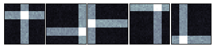
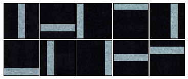
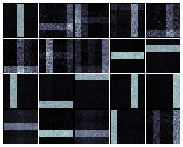
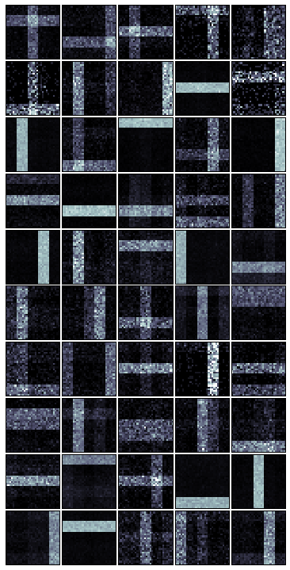

.. code:: python

    import numpy as np
    import bnpy
    
    from matplotlib import pylab
    %pylab inline

.. parsed-literal::

    Populating the interactive namespace from numpy and matplotlib

.. code:: python

    import BarsK10V900
    Data = BarsK10V900.get_data(nObsTotal=20000)
.. code:: python

    hmodel, RInfo = bnpy.run(Data, 'MixModel', 'Mult', 'EM', K=10, nLap=500)

.. parsed-literal::

    Toy Bars Data with 10 true topics. Each doc uses 1-3 bars.
      size: 2000 units (documents)
      vocab size: 900
      min    5%   50%   95%   max 
      157   169   208   255   288  nUniqueTokensPerDoc
      360   360   360   360   360  nTotalTokensPerDoc
    Allocation Model:  Finite mixture with K=10. Dir prior param 1.00
    Obs. Data  Model:  Multinomial over finite vocabulary.
    Obs. Data  Prior:  Dirichlet over finite vocabulary 
      lam = [ 0.1  0.1] ...
    Learn Alg: EM
    Trial  1/1 | alg. seed: 4226944 | data order seed: 8541952
    savepath: /Users/mni/bnpy-dev/results/BarsK10V900/defaultjob/1
            1/500 after      0 sec. | K   10 | ev -8.080870102e+00 |  
            2/500 after      0 sec. | K   10 | ev -6.117188594e+00 | Ndiff     30.133 
            3/500 after      0 sec. | K   10 | ev -6.097556650e+00 | Ndiff    111.500 
            4/500 after      0 sec. | K   10 | ev -6.062461681e+00 | Ndiff     17.322 
            5/500 after      0 sec. | K   10 | ev -6.055070094e+00 | Ndiff      6.244 
            6/500 after      0 sec. | K   10 | ev -6.054513879e+00 | Ndiff      1.897 
            7/500 after      0 sec. | K   10 | ev -6.054445580e+00 | Ndiff      0.542 
            8/500 after      0 sec. | K   10 | ev -6.054437903e+00 | Ndiff      1.084 
            9/500 after      0 sec. | K   10 | ev -6.054408446e+00 | Ndiff      1.857 
           10/500 after      0 sec. | K   10 | ev -6.054367640e+00 | Ndiff      1.730 
           11/500 after      0 sec. | K   10 | ev -6.054327860e+00 | Ndiff      0.188 
           12/500 after      0 sec. | K   10 | ev -6.054324988e+00 | Ndiff      0.764 
           13/500 after      0 sec. | K   10 | ev -6.054312871e+00 | Ndiff      0.083 
           14/500 after      0 sec. | K   10 | ev -6.054312755e+00 | Ndiff      0.002 
    ... done. converged.

.. code:: python

    for K in [5, 10, 20, 50]:
        hmodel, RInfo = bnpy.run(Data, 'MixModel', 'Mult', 'EM', K=K, nLap=500, doWriteStdOut=False)
        print 'K=%3d | final ev % .5f' % (K, RInfo['evBound'])
        bnpy.viz.BarsViz.plotBarsFromHModel(hmodel);

.. parsed-literal::

    K=  5 | final ev -6.34654
    K= 10 | final ev -6.05431
    K= 20 | final ev -6.01575
    K= 50 | final ev -5.96263

