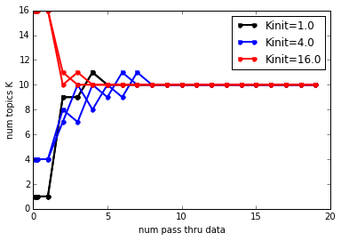
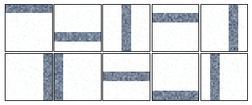

Learning DP Mixtures on Toy Bars Data with Birth and Merge moves
================================================================

Goal
----

This demo walks you through using **bnpy** from within python to train a
Dirichlet process (DP) mixture model on **bag-of-words** data. We'll use
memoized variational inference with birth and merge moves.

We can use the following import statements to load bnpy.

.. code:: python

    import bnpy
    
    from matplotlib import pylab
    %pylab inline
    
    imshowArgs = dict(interpolation='nearest', 
                      cmap='bone_r', 
                      vmin=0.0, 
                      vmax=10./900,
                      )

.. parsed-literal::

    Populating the interactive namespace from numpy and matplotlib

Toy dataset : ``MixBarsK10V900``
--------------------------------

We'll use a simple "toy bars" dataset generated from a mixture model.

**Our task here is to assign exactly one cluster to every whole
document. Be aware that this is different than assigning a cluster/topic
to each word token, like in LDA or HDP topic models. **

.. code:: python

    import MixBarsK10V900
    Data = MixBarsK10V900.get_data(nDocTotal=1000, nWordsPerDoc=100)
    Data.name = 'MixBarsK10V900'
First, we can visualize the 10 "true" topics. Each one is a distribution
over the same set of 900 vocabulary "words". We can show this
distribution as an image with 30x30 pixels, where each pixel's intensity
indicates the probability of the corresponding word.

.. code:: python

    bnpy.viz.BarsViz.showTopicsAsSquareImages(MixBarsK10V900.Defaults['topics'], **imshowArgs)

.. image:: BarsToyData-DPMixtureModel-MemoizedWithBirthsAndMerges_files/BarsToyData-DPMixtureModel-MemoizedWithBirthsAndMerges_7_0.png

.. image:: BarsToyData-DPMixtureModel-MemoizedWithBirthsAndMerges_files/BarsToyData-DPMixtureModel-MemoizedWithBirthsAndMerges_7_1.png

Next, we can visualize some example documents.

.. code:: python

    bnpy.viz.BarsViz.plotExampleBarsDocs(Data, **imshowArgs)

Running inference with **bnpy**
===============================

We'll fit a DP mixture model with a multinomial likelihood, using birth
and merge moves. We use the ``moves`` keyword argument to specify which
moves to employ.

We'll look at several possible initial numbers of clusters, and show
that the birth/merge moves consistently reach the ideal set of 8
clusters.

1 initial cluster, repeated for 2 trials
----------------------------------------

.. code:: python

    hmodel, RInfo = bnpy.run(Data, 'DPMixtureModel', 'Mult', 'moVB',
                             nLap=20, K=1, lam=0.1, moves='birth,merge', 
                             nTask=2, jobname='demobirthmerge-Kinit=1')

.. parsed-literal::

    Toy Bars Data with 10 true topics. Each doc uses ONE topic.
    Entire Dataset Summary:
      total size: 1000 units
      batch size: 100 units
      num. batches: 10
    Data for Initialization:
      size: 1000 units (documents)
      vocab size: 900
      min    5%   50%   95%   max 
       66    73    79    84    88  nUniqueTokensPerDoc
      100   100   100   100   100  nTotalTokensPerDoc
    Hist of word_count across tokens 
          1      2      3    <10   <100  >=100
       0.77   0.19   0.03    382      0      0
    Hist of unique docs per word type
         <1    <10   <100  <0.20  <0.50 >=0.50
          0      0   0.93   0.07      0      0
    Allocation Model:  DP mixture with K=1. Concentration gamma0= 1.00
    Obs. Data  Model:  Multinomial over finite vocabulary.
    Obs. Data  Prior:  Dirichlet over finite vocabulary 
      lam = [ 0.1  0.1] ...
    Learn Alg: moVB
    Trial  1/2 | alg. seed: 2497280 | data order seed: 8541952
    savepath: /results/MixBarsK10V900/demobirthmerge-Kinit=1/1
        0.100/20 after      0 sec. | K    1 | ev -6.969793109e+00 |  
        0.200/20 after      0 sec. | K    1 | ev -6.910657011e+00 |  
        0.300/20 after      0 sec. | K    1 | ev -6.885383576e+00 |  
        1.000/20 after      0 sec. | K    1 | ev -6.833745697e+00 |  
    BIRTH ACCEPTED. 8 fresh comps.
    MERGE 0/0 accepted. 
        2.000/20 after      0 sec. | K    9 | ev -5.682738824e+00 | Ndiff     93.000 
    MERGE 0/0 accepted. 
        3.000/20 after      0 sec. | K    9 | ev -5.671719201e+00 | Ndiff      0.000 
    BIRTH ACCEPTED. 2 fresh comps.
    MERGE 0/0 accepted. 
        4.000/20 after      0 sec. | K   11 | ev -5.580876852e+00 | Ndiff     93.000 
    MERGE 1/1 accepted. ev increased  1.3314e-03
        5.000/20 after      1 sec. | K   10 | ev -5.579190605e+00 | Ndiff      0.000 
    MERGE 0/0 accepted. 
        6.000/20 after      1 sec. | K   10 | ev -5.579190605e+00 | Ndiff      0.000 
    MERGE 0/0 accepted. 
        7.000/20 after      1 sec. | K   10 | ev -5.579190605e+00 | Ndiff      0.000 
    MERGE 0/0 accepted. 
        8.000/20 after      1 sec. | K   10 | ev -5.579190605e+00 | Ndiff      0.000 
    MERGE 0/0 accepted. 
        9.000/20 after      1 sec. | K   10 | ev -5.579190605e+00 | Ndiff      0.000 
    MERGE 0/0 accepted. 
       10.000/20 after      1 sec. | K   10 | ev -5.579190605e+00 | Ndiff      0.000 
    MERGE 0/0 accepted. 
       11.000/20 after      1 sec. | K   10 | ev -5.579190605e+00 | Ndiff      0.000 
    MERGE 0/0 accepted. 
       12.000/20 after      1 sec. | K   10 | ev -5.579190605e+00 | Ndiff      0.000 
    MERGE 0/0 accepted. 
       13.000/20 after      1 sec. | K   10 | ev -5.579190605e+00 | Ndiff      0.000 
    MERGE 0/0 accepted. 
       14.000/20 after      2 sec. | K   10 | ev -5.579190605e+00 | Ndiff      0.000 
    MERGE 0/0 accepted. 
       15.000/20 after      2 sec. | K   10 | ev -5.579190605e+00 | Ndiff      0.000 
    MERGE 0/0 accepted. 
       16.000/20 after      2 sec. | K   10 | ev -5.579190605e+00 | Ndiff      0.000 
    MERGE 0/0 accepted. 
       17.000/20 after      2 sec. | K   10 | ev -5.579190605e+00 | Ndiff      0.000 
    MERGE 0/0 accepted. 
       18.000/20 after      2 sec. | K   10 | ev -5.579190605e+00 | Ndiff      0.000 
    MERGE 0/0 accepted. 
       19.000/20 after      2 sec. | K   10 | ev -5.579190605e+00 | Ndiff      0.000 
    ... done. converged.
    Trial  2/2 | alg. seed: 1128064 | data order seed: 7673856
    savepath: /results/MixBarsK10V900/demobirthmerge-Kinit=1/2
        0.100/20 after      0 sec. | K    1 | ev -6.981597526e+00 |  
        0.200/20 after      0 sec. | K    1 | ev -6.916391582e+00 |  
        0.300/20 after      0 sec. | K    1 | ev -6.880774941e+00 |  
        1.000/20 after      0 sec. | K    1 | ev -6.833745697e+00 |  
    BIRTH ACCEPTED. 8 fresh comps.
    MERGE 0/0 accepted. 
        2.000/20 after      0 sec. | K    9 | ev -5.673084280e+00 | Ndiff     92.000 
    MERGE 0/0 accepted. 
        3.000/20 after      0 sec. | K    9 | ev -5.668395610e+00 | Ndiff      0.000 
    BIRTH ACCEPTED. 2 fresh comps.
    MERGE 0/0 accepted. 
        4.000/20 after      1 sec. | K   11 | ev -5.579253419e+00 | Ndiff     89.000 
    MERGE 1/1 accepted. ev increased  6.5338e-05
        5.000/20 after      1 sec. | K   10 | ev -5.579188081e+00 | Ndiff      0.000 
    MERGE 0/0 accepted. 
        6.000/20 after      1 sec. | K   10 | ev -5.579188081e+00 | Ndiff      0.000 
    MERGE 0/0 accepted. 
        7.000/20 after      1 sec. | K   10 | ev -5.579188081e+00 | Ndiff      0.000 
    MERGE 0/0 accepted. 
        8.000/20 after      1 sec. | K   10 | ev -5.579188081e+00 | Ndiff      0.000 
    MERGE 0/0 accepted. 
        9.000/20 after      1 sec. | K   10 | ev -5.579188081e+00 | Ndiff      0.000 
    MERGE 0/0 accepted. 
       10.000/20 after      1 sec. | K   10 | ev -5.579188081e+00 | Ndiff      0.000 
    MERGE 0/0 accepted. 
       11.000/20 after      1 sec. | K   10 | ev -5.579188081e+00 | Ndiff      0.000 
    MERGE 0/0 accepted. 
       12.000/20 after      1 sec. | K   10 | ev -5.579188081e+00 | Ndiff      0.000 
    MERGE 0/0 accepted. 
       13.000/20 after      1 sec. | K   10 | ev -5.579188081e+00 | Ndiff      0.000 
    MERGE 0/0 accepted. 
       14.000/20 after      2 sec. | K   10 | ev -5.579188081e+00 | Ndiff      0.000 
    MERGE 0/0 accepted. 
       15.000/20 after      2 sec. | K   10 | ev -5.579188081e+00 | Ndiff      0.000 
    MERGE 0/0 accepted. 
       16.000/20 after      2 sec. | K   10 | ev -5.579188081e+00 | Ndiff      0.000 
    MERGE 0/0 accepted. 
       17.000/20 after      2 sec. | K   10 | ev -5.579188081e+00 | Ndiff      0.000 
    MERGE 0/0 accepted. 
       18.000/20 after      2 sec. | K   10 | ev -5.579188081e+00 | Ndiff      0.000 
    MERGE 0/0 accepted. 
       19.000/20 after      2 sec. | K   10 | ev -5.579188081e+00 | Ndiff      0.000 
    ... done. converged.

4 initial clusters, repeated for 2 trials
-----------------------------------------

.. code:: python

    hmodel, RInfo = bnpy.run(Data, 'DPMixtureModel', 'Mult', 'moVB',
                             nLap=20, K=4, lam=0.1, moves='birth,merge', 
                             nTask=2, jobname='demobirthmerge-Kinit=4')

.. parsed-literal::

    Toy Bars Data with 10 true topics. Each doc uses ONE topic.
    Entire Dataset Summary:
      total size: 1000 units
      batch size: 100 units
      num. batches: 10
    Data for Initialization:
      size: 1000 units (documents)
      vocab size: 900
      min    5%   50%   95%   max 
       66    73    79    84    88  nUniqueTokensPerDoc
      100   100   100   100   100  nTotalTokensPerDoc
    Hist of word_count across tokens 
          1      2      3    <10   <100  >=100
       0.77   0.19   0.03    382      0      0
    Hist of unique docs per word type
         <1    <10   <100  <0.20  <0.50 >=0.50
          0      0   0.93   0.07      0      0
    Allocation Model:  DP mixture with K=4. Concentration gamma0= 1.00
    Obs. Data  Model:  Multinomial over finite vocabulary.
    Obs. Data  Prior:  Dirichlet over finite vocabulary 
      lam = [ 0.1  0.1] ...
    Learn Alg: moVB
    Trial  1/2 | alg. seed: 2497280 | data order seed: 8541952
    savepath: /results/MixBarsK10V900/demobirthmerge-Kinit=4/1
        0.100/20 after      0 sec. | K    4 | ev -6.740510449e+00 |  
        0.200/20 after      0 sec. | K    4 | ev -6.571153609e+00 |  
        0.300/20 after      0 sec. | K    4 | ev -6.492200573e+00 |  
        1.000/20 after      0 sec. | K    4 | ev -6.312338396e+00 |  
    BIRTH ACCEPTED. 4 fresh comps.
    MERGE 0/0 accepted. 
        2.000/20 after      0 sec. | K    8 | ev -5.896559293e+00 | Ndiff     48.000 
    MERGE 1/1 accepted. ev increased  1.0139e-03
        3.000/20 after      0 sec. | K    7 | ev -5.895542786e+00 | Ndiff      0.000 
    BIRTH ACCEPTED. 3 fresh comps.
    MERGE 0/0 accepted. 
        4.000/20 after      0 sec. | K   10 | ev -5.670595821e+00 | Ndiff     62.000 
    MERGE 1/1 accepted. ev increased  2.9988e-03
        5.000/20 after      1 sec. | K    9 | ev -5.667199827e+00 | Ndiff      0.000 
    BIRTH ACCEPTED. 2 fresh comps.
    MERGE 0/0 accepted. 
        6.000/20 after      1 sec. | K   11 | ev -5.579252348e+00 | Ndiff     88.000 
    MERGE 1/1 accepted. ev increased  6.5468e-05
        7.000/20 after      1 sec. | K   10 | ev -5.579186880e+00 | Ndiff      0.000 
    MERGE 0/0 accepted. 
        8.000/20 after      1 sec. | K   10 | ev -5.579186880e+00 | Ndiff      0.000 
    MERGE 0/0 accepted. 
        9.000/20 after      1 sec. | K   10 | ev -5.579186880e+00 | Ndiff      0.000 
    MERGE 0/0 accepted. 
       10.000/20 after      1 sec. | K   10 | ev -5.579186880e+00 | Ndiff      0.000 
    MERGE 0/0 accepted. 
       11.000/20 after      1 sec. | K   10 | ev -5.579186880e+00 | Ndiff      0.000 
    MERGE 0/0 accepted. 
       12.000/20 after      1 sec. | K   10 | ev -5.579186880e+00 | Ndiff      0.000 
    MERGE 0/0 accepted. 
       13.000/20 after      1 sec. | K   10 | ev -5.579186880e+00 | Ndiff      0.000 
    MERGE 0/0 accepted. 
       14.000/20 after      1 sec. | K   10 | ev -5.579186880e+00 | Ndiff      0.000 
    MERGE 0/0 accepted. 
       15.000/20 after      2 sec. | K   10 | ev -5.579186880e+00 | Ndiff      0.000 
    MERGE 0/0 accepted. 
       16.000/20 after      2 sec. | K   10 | ev -5.579186880e+00 | Ndiff      0.000 
    MERGE 0/0 accepted. 
       17.000/20 after      2 sec. | K   10 | ev -5.579186880e+00 | Ndiff      0.000 
    MERGE 0/0 accepted. 
       18.000/20 after      2 sec. | K   10 | ev -5.579186880e+00 | Ndiff      0.000 
    MERGE 0/0 accepted. 
       19.000/20 after      2 sec. | K   10 | ev -5.579186880e+00 | Ndiff      0.000 
    ... done. converged.
    Trial  2/2 | alg. seed: 1128064 | data order seed: 7673856
    savepath: /results/MixBarsK10V900/demobirthmerge-Kinit=4/2
        0.100/20 after      0 sec. | K    4 | ev -6.731800712e+00 |  
        0.200/20 after      0 sec. | K    4 | ev -6.518718345e+00 |  
        0.300/20 after      0 sec. | K    4 | ev -6.427244547e+00 |  
        1.000/20 after      0 sec. | K    4 | ev -6.252611666e+00 |  
    BIRTH ACCEPTED. 3 fresh comps.
    MERGE 0/0 accepted. 
        2.000/20 after      0 sec. | K    7 | ev -5.987733905e+00 | Ndiff     61.000 
    BIRTH ACCEPTED. 3 fresh comps.
    MERGE 0/0 accepted. 
        3.000/20 after      0 sec. | K   10 | ev -5.762998351e+00 | Ndiff     61.000 
    MERGE 2/2 accepted. ev increased  2.0063e-03
        4.000/20 after      0 sec. | K    8 | ev -5.760988104e+00 | Ndiff      0.000 
    BIRTH ACCEPTED. 2 fresh comps.
    MERGE 0/0 accepted. 
        5.000/20 after      1 sec. | K   10 | ev -5.667997831e+00 | Ndiff     88.000 
    MERGE 1/1 accepted. ev increased  7.2433e-04
        6.000/20 after      1 sec. | K    9 | ev -5.667010822e+00 | Ndiff      0.000 
    BIRTH ACCEPTED. 2 fresh comps.
    MERGE 0/0 accepted. 
        7.000/20 after      1 sec. | K   11 | ev -5.579250413e+00 | Ndiff     87.000 
    MERGE 1/1 accepted. ev increased  6.5294e-05
        8.000/20 after      1 sec. | K   10 | ev -5.579185119e+00 | Ndiff      0.000 
    MERGE 0/0 accepted. 
        9.000/20 after      1 sec. | K   10 | ev -5.579185119e+00 | Ndiff      0.000 
    MERGE 0/0 accepted. 
       10.000/20 after      1 sec. | K   10 | ev -5.579185119e+00 | Ndiff      0.000 
    MERGE 0/0 accepted. 
       11.000/20 after      1 sec. | K   10 | ev -5.579185119e+00 | Ndiff      0.000 
    MERGE 0/0 accepted. 
       12.000/20 after      1 sec. | K   10 | ev -5.579185119e+00 | Ndiff      0.000 
    MERGE 0/0 accepted. 
       13.000/20 after      1 sec. | K   10 | ev -5.579185119e+00 | Ndiff      0.000 
    MERGE 0/0 accepted. 
       14.000/20 after      2 sec. | K   10 | ev -5.579185119e+00 | Ndiff      0.000 
    MERGE 0/0 accepted. 
       15.000/20 after      2 sec. | K   10 | ev -5.579185119e+00 | Ndiff      0.000 
    MERGE 0/0 accepted. 
       16.000/20 after      2 sec. | K   10 | ev -5.579185119e+00 | Ndiff      0.000 
    MERGE 0/0 accepted. 
       17.000/20 after      2 sec. | K   10 | ev -5.579185119e+00 | Ndiff      0.000 
    MERGE 0/0 accepted. 
       18.000/20 after      2 sec. | K   10 | ev -5.579185119e+00 | Ndiff      0.000 
    MERGE 0/0 accepted. 
       19.000/20 after      2 sec. | K   10 | ev -5.579185119e+00 | Ndiff      0.000 
    ... done. converged.

16 initial clusters, repeated for 2 trials
------------------------------------------

.. code:: python

    hmodel, RInfo = bnpy.run(Data, 'DPMixtureModel', 'Mult', 'moVB',
                             nLap=20, K=16, lam=0.1, moves='birth,merge', 
                             nTask=2, jobname='demobirthmerge-Kinit=16')

.. parsed-literal::

    Toy Bars Data with 10 true topics. Each doc uses ONE topic.
    Entire Dataset Summary:
      total size: 1000 units
      batch size: 100 units
      num. batches: 10
    Data for Initialization:
      size: 1000 units (documents)
      vocab size: 900
      min    5%   50%   95%   max 
       66    73    79    84    88  nUniqueTokensPerDoc
      100   100   100   100   100  nTotalTokensPerDoc
    Hist of word_count across tokens 
          1      2      3    <10   <100  >=100
       0.77   0.19   0.03    382      0      0
    Hist of unique docs per word type
         <1    <10   <100  <0.20  <0.50 >=0.50
          0      0   0.93   0.07      0      0
    Allocation Model:  DP mixture with K=16. Concentration gamma0= 1.00
    Obs. Data  Model:  Multinomial over finite vocabulary.
    Obs. Data  Prior:  Dirichlet over finite vocabulary 
      lam = [ 0.1  0.1] ...
    Learn Alg: moVB
    Trial  1/2 | alg. seed: 2497280 | data order seed: 8541952
    savepath: /results/MixBarsK10V900/demobirthmerge-Kinit=16/1
        0.100/20 after      0 sec. | K   16 | ev -6.419219019e+00 |  
        0.200/20 after      0 sec. | K   16 | ev -6.094286752e+00 |  
        0.300/20 after      0 sec. | K   16 | ev -5.940957526e+00 |  
        1.000/20 after      0 sec. | K   16 | ev -5.664293326e+00 |  
    MERGE 5/5 accepted. ev increased  1.2310e-02
        2.000/20 after      0 sec. | K   11 | ev -5.581792852e+00 | Ndiff      0.000 
    MERGE 1/1 accepted. ev increased  1.6549e-03
        3.000/20 after      0 sec. | K   10 | ev -5.579189293e+00 | Ndiff      0.000 
    MERGE 0/0 accepted. 
        4.000/20 after      1 sec. | K   10 | ev -5.579189293e+00 | Ndiff      0.000 
    MERGE 0/0 accepted. 
        5.000/20 after      1 sec. | K   10 | ev -5.579189293e+00 | Ndiff      0.000 
    MERGE 0/0 accepted. 
        6.000/20 after      1 sec. | K   10 | ev -5.579189293e+00 | Ndiff      0.000 
    MERGE 0/0 accepted. 
        7.000/20 after      1 sec. | K   10 | ev -5.579189293e+00 | Ndiff      0.000 
    MERGE 0/0 accepted. 
        8.000/20 after      1 sec. | K   10 | ev -5.579189293e+00 | Ndiff      0.000 
    MERGE 0/0 accepted. 
        9.000/20 after      1 sec. | K   10 | ev -5.579189293e+00 | Ndiff      0.000 
    MERGE 0/0 accepted. 
       10.000/20 after      1 sec. | K   10 | ev -5.579189293e+00 | Ndiff      0.000 
    MERGE 0/0 accepted. 
       11.000/20 after      1 sec. | K   10 | ev -5.579189293e+00 | Ndiff      0.000 
    MERGE 0/0 accepted. 
       12.000/20 after      1 sec. | K   10 | ev -5.579189293e+00 | Ndiff      0.000 
    MERGE 0/0 accepted. 
       13.000/20 after      1 sec. | K   10 | ev -5.579189293e+00 | Ndiff      0.000 
    MERGE 0/0 accepted. 
       14.000/20 after      2 sec. | K   10 | ev -5.579189293e+00 | Ndiff      0.000 
    MERGE 0/0 accepted. 
       15.000/20 after      2 sec. | K   10 | ev -5.579189293e+00 | Ndiff      0.000 
    MERGE 0/0 accepted. 
       16.000/20 after      2 sec. | K   10 | ev -5.579189293e+00 | Ndiff      0.000 
    MERGE 0/0 accepted. 
       17.000/20 after      2 sec. | K   10 | ev -5.579189293e+00 | Ndiff      0.000 
    MERGE 0/0 accepted. 
       18.000/20 after      2 sec. | K   10 | ev -5.579189293e+00 | Ndiff      0.000 
    MERGE 0/0 accepted. 
       19.000/20 after      2 sec. | K   10 | ev -5.579189293e+00 | Ndiff      0.000 
    ... done. converged.
    Trial  2/2 | alg. seed: 1128064 | data order seed: 7673856
    savepath: /results/MixBarsK10V900/demobirthmerge-Kinit=16/2
        0.100/20 after      0 sec. | K   16 | ev -6.372100577e+00 |  
        0.200/20 after      0 sec. | K   16 | ev -6.068842570e+00 |  
        0.300/20 after      0 sec. | K   16 | ev -5.930562281e+00 |  
        1.000/20 after      0 sec. | K   16 | ev -5.719622612e+00 |  
    MERGE 6/6 accepted. ev increased  1.6625e-02
        2.000/20 after      0 sec. | K   10 | ev -5.675899603e+00 | Ndiff      0.000 
    BIRTH ACCEPTED. 2 fresh comps.
    MERGE 1/1 accepted. ev increased  2.0633e-03
        3.000/20 after      1 sec. | K   11 | ev -5.579254286e+00 | Ndiff     21.000 
    MERGE 1/1 accepted. ev increased  6.6657e-05
        4.000/20 after      1 sec. | K   10 | ev -5.579187626e+00 | Ndiff      0.000 
    MERGE 0/0 accepted. 
        5.000/20 after      1 sec. | K   10 | ev -5.579187626e+00 | Ndiff      0.000 
    MERGE 0/0 accepted. 
        6.000/20 after      1 sec. | K   10 | ev -5.579187626e+00 | Ndiff      0.000 
    MERGE 0/0 accepted. 
        7.000/20 after      1 sec. | K   10 | ev -5.579187626e+00 | Ndiff      0.000 
    MERGE 0/0 accepted. 
        8.000/20 after      1 sec. | K   10 | ev -5.579187626e+00 | Ndiff      0.000 
    MERGE 0/0 accepted. 
        9.000/20 after      1 sec. | K   10 | ev -5.579187626e+00 | Ndiff      0.000 
    MERGE 0/0 accepted. 
       10.000/20 after      1 sec. | K   10 | ev -5.579187626e+00 | Ndiff      0.000 
    MERGE 0/0 accepted. 
       11.000/20 after      1 sec. | K   10 | ev -5.579187626e+00 | Ndiff      0.000 
    MERGE 0/0 accepted. 
       12.000/20 after      1 sec. | K   10 | ev -5.579187626e+00 | Ndiff      0.000 
    MERGE 0/0 accepted. 
       13.000/20 after      2 sec. | K   10 | ev -5.579187626e+00 | Ndiff      0.000 
    MERGE 0/0 accepted. 
       14.000/20 after      2 sec. | K   10 | ev -5.579187626e+00 | Ndiff      0.000 
    MERGE 0/0 accepted. 
       15.000/20 after      2 sec. | K   10 | ev -5.579187626e+00 | Ndiff      0.000 
    MERGE 0/0 accepted. 
       16.000/20 after      2 sec. | K   10 | ev -5.579187626e+00 | Ndiff      0.000 
    MERGE 0/0 accepted. 
       17.000/20 after      2 sec. | K   10 | ev -5.579187626e+00 | Ndiff      0.000 
    MERGE 0/0 accepted. 
       18.000/20 after      2 sec. | K   10 | ev -5.579187626e+00 | Ndiff      0.000 
    MERGE 0/0 accepted. 
       19.000/20 after      2 sec. | K   10 | ev -5.579187626e+00 | Ndiff      0.000 
    ... done. converged.

Frequently asked questions
==========================

How do I plot the objective function over time?
-----------------------------------------------

Here, we plot the log evidence (sometimes called the evidence lower
bound or ELBO). Here, larger objective scores indicate better model
quality.

.. code:: python

    from matplotlib import pylab
    %pylab inline
    
    bnpy.viz.PlotELBO.plotJobsThatMatchKeywords('MixBarsK10V900/demobirthmerge-*');
    pylab.legend(loc='lower right');

.. parsed-literal::

    Populating the interactive namespace from numpy and matplotlib

**Conclusion:** All the different initial conditions quickly converge to
similar scores of high quality.

How do I plot the number of clusters over time?
-----------------------------------------------

.. code:: python

    bnpy.viz.PlotELBO.plotJobsThatMatchKeywords('MixBarsK10V900/demobirthmerge-*', yvar='K');

\*\* Conclusion:\*\* Across very different initial conditions, we
consistently reach exactly 8 learned clusters.

How do I plot the final learned clusters?
-----------------------------------------

.. code:: python

    bnpy.viz.PlotComps.plotCompsForTask('MixBarsK10V900/demobirthmerge-Kinit=16/1/', **imshowArgs)

\*\* Conclusion:\*\* This run discovers the 10 ideal bars topics.

How do I plot the initial clusters?
-----------------------------------

.. code:: python

    bnpy.viz.PlotComps.plotCompsForTask('MixBarsK10V900/demobirthmerge-Kinit=16/1/', lap=0, **imshowArgs)

How do I plot the clusters after 2 passes through the data?
-----------------------------------------------------------

.. code:: python

    bnpy.viz.PlotComps.plotCompsForTask('MixBarsK10V900/demobirthmerge-Kinit=16/1/', lap=2, **imshowArgs)

