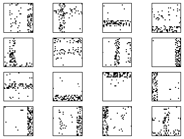
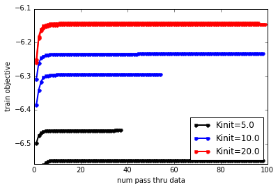
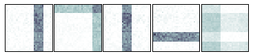
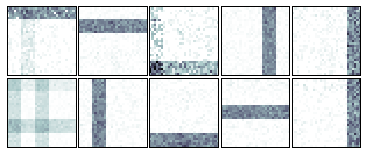
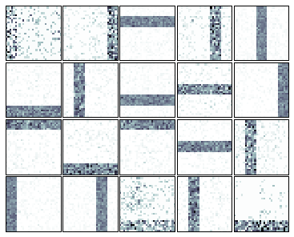

Learning an LDA topic model on Toy Bars Data with variational inference
=======================================================================

Goal
----

This demo walks you through using **bnpy** from within python to train a
Latent Dirichlet Allocation (LDA) topic model on **bag-of-words** data.
We'll use the full-dataset variational inference algorithm.

We can use the following import statements to load bnpy.

.. code:: python

    import bnpy
    
    from matplotlib import pylab
    %pylab inline
    
    imshowArgs = dict(interpolation='nearest', 
                      cmap='bone_r', 
                      vmin=0.0, 
                      vmax=10./900,
                      )

.. parsed-literal::

    Populating the interactive namespace from numpy and matplotlib

Toy dataset : ``BarsK10V900``
-----------------------------

We'll use a simple "toy bars" dataset called ``BarsK10V900``, generated
from the LDA topic model.

**Our intended task here is to assign exactly one topic to every token.
The data was generated this way.**

Be aware that this is different than assigning a single cluster/topic to
the entire document.

.. code:: python

    import BarsK10V900
    Data = BarsK10V900.get_data(nDocTotal=1000, nWordsPerDoc=100)
    Data.name = 'BarsK10V900'
First, we can visualize the 10 "true" bar topics. Each one is a
distribution over 900 vocabulary "words", which are represented here as
individual pixels in a 30x30 image.

.. code:: python

    bnpy.viz.BarsViz.showTopicsAsSquareImages(BarsK10V900.Defaults['topics'], **imshowArgs);

.. image:: BarsToyData-FiniteTopicModel-Variational_files/BarsToyData-FiniteTopicModel-Variational_7_0.png

Next, we can visualize some example documents. Here are 16 documents

.. code:: python

    bnpy.viz.BarsViz.plotExampleBarsDocs(Data, nDocToPlot=16, **imshowArgs);

Important keyword options for topic models
------------------------------------------

--K
~~~

The initial number of topics (aka clusters) is determined by this
integer. For finite models like LDA, once this is set, for the rest of
the algorithm we will represent **exactly** this many topics in memory.
We cannot add more, or remove any. Some topic's frequency parameters may
be pushed to zero, but we will still represent them in the computer.

--initname
~~~~~~~~~~

This string specifies the initialization procedure for the topic-word
parameters. Here are the options

::

    * kmeansplusplus [Recommended]

Runs kmeans on the empirical document word-count vectors, using the
specified number of clusters :math:`K`.

::

    * randexamples [Default]

Selects :math:`K` documents at random without replacement. Can be bad
because it does not

::

    * randomlikewang

Draws each topic-word variational parameter vector :math:`\tau` as a
Gamma random variable. This is the same procedure used in Wang et al.'s
original Python code for HDP topic models.

.. math::

   \qquad \qquad \tau_{kv} \sim \mbox{Gamma}(100), \forall k,v

--alpha
~~~~~~~

This positive scalar controls the sparsity of the Dirichlet prior on the
document-topic assignments.

Set this value smaller (like 0.1 or smaller) to encourage more sparsity
in these distributions.

Setting it large (like 10 or 100) will cause all the documents to use
all the topics uniformly, which is bad.

--nCoordAscentItersLP
~~~~~~~~~~~~~~~~~~~~~

This integer specifies how long to run the local "E" step algorithm,
which alternately updates free variational parameters for (1) every
token in the document, and (2) the document-specific topic distribution.

Larger values will let the algorithm converge more, but at the cost of
more computation. Usually setting this to 10 is too small, while 200
would maybe be too large unless there are many many topics.

--convThrLP
~~~~~~~~~~~

The local "E" step is run at each document, alternating the two steps
above until the estimated document-topic counts for the document
:math:`[N_{d1} \ldots N_{dk} \ldots N_{dK}]`. We halt the iterations if
all values in this vector change by less than ``convThrLP``.

This value defaults to 0.01, which should be fine for most purposes.

Running inference with **bnpy**
===============================

We'll now fit a finite topic model (LDA) with a multinomial likelihood,
using standard variational inference (specified by the ``VB`` keyword
option).

We'll look at several possible initial numbers of clusters.

5 initial clusters, repeated for 2 trials
-----------------------------------------

.. code:: python

    hmodel, RInfo = bnpy.run(Data, 'FiniteTopicModel', 'Mult', 'VB',
                             K=5, alpha=0.1, lam=0.1, initname='kmeansplusplus',
                             nLap=500, printEvery=25, nCoordAscentItersLP=25,
                             nTask=2, jobname='demobarsVB-Kinit=5-kmeans')

.. parsed-literal::

    Toy Bars Data with 10 true topics. Each doc uses 1-3 bars.
      size: 1000 units (documents)
      vocab size: 900
      min    5%   50%   95%   max 
       68    76    85    92    99  nUniqueTokensPerDoc
      100   100   100   100   100  nTotalTokensPerDoc
    Hist of word_count across tokens 
          1      2      3    <10   <100  >=100
       0.84   0.14   0.02    200      0      0
    Hist of unique docs per word type
         <1    <10   <100  <0.20  <0.50 >=0.50
          0      0   0.75   0.25      0      0
    Allocation Model:  Finite LDA model with K=5 comps. alpha=0.10
    Obs. Data  Model:  Multinomial over finite vocabulary.
    Obs. Data  Prior:  Dirichlet over finite vocabulary 
      lam = [ 0.1  0.1] ...
    Learn Alg: VB
    Trial  1/2 | alg. seed: 2497280 | data order seed: 8541952
    savepath: /results/BarsK10V900/demobarsVB-Kinit=5-kmeans/1
            1/500 after      1 sec. | K    5 | ev -6.497725357e+00 |  
            2/500 after      1 sec. | K    5 | ev -6.474361847e+00 | Ndiff    256.402 
           25/500 after      3 sec. | K    5 | ev -6.459785851e+00 | Ndiff      0.705 
           37/500 after      5 sec. | K    5 | ev -6.459734310e+00 | Ndiff      0.048 
    ... done. converged.
    Trial  2/2 | alg. seed: 1128064 | data order seed: 7673856
    savepath: /results/BarsK10V900/demobarsVB-Kinit=5-kmeans/2
            1/500 after      0 sec. | K    5 | ev -6.605946952e+00 |  
            2/500 after      1 sec. | K    5 | ev -6.580567563e+00 | Ndiff   1810.242 
           25/500 after      4 sec. | K    5 | ev -6.548944331e+00 | Ndiff      1.797 
           50/500 after      6 sec. | K    5 | ev -6.548918037e+00 | Ndiff      0.192 
           75/500 after      8 sec. | K    5 | ev -6.548903603e+00 | Ndiff      0.164 
           98/500 after     10 sec. | K    5 | ev -6.548881828e+00 | Ndiff      0.013 
    ... done. converged.

10 initial clusters, repeated for 2 trials
------------------------------------------

.. code:: python

    hmodel, RInfo = bnpy.run(Data, 'FiniteTopicModel', 'Mult', 'VB',
                             K=10, alpha=0.1, lam=0.1, initname='kmeansplusplus',
                             nLap=500, printEvery=25, nCoordAscentItersLP=25,
                             nTask=2, jobname='demobarsVB-Kinit=10-kmeans')

.. parsed-literal::

    Toy Bars Data with 10 true topics. Each doc uses 1-3 bars.
      size: 1000 units (documents)
      vocab size: 900
      min    5%   50%   95%   max 
       68    76    85    92    99  nUniqueTokensPerDoc
      100   100   100   100   100  nTotalTokensPerDoc
    Hist of word_count across tokens 
          1      2      3    <10   <100  >=100
       0.84   0.14   0.02    200      0      0
    Hist of unique docs per word type
         <1    <10   <100  <0.20  <0.50 >=0.50
          0      0   0.75   0.25      0      0
    Allocation Model:  Finite LDA model with K=10 comps. alpha=0.10
    Obs. Data  Model:  Multinomial over finite vocabulary.
    Obs. Data  Prior:  Dirichlet over finite vocabulary 
      lam = [ 0.1  0.1] ...
    Learn Alg: VB
    Trial  1/2 | alg. seed: 2497280 | data order seed: 8541952
    savepath: /results/BarsK10V900/demobarsVB-Kinit=10-kmeans/1
            1/500 after      1 sec. | K   10 | ev -6.384955954e+00 |  
            2/500 after      1 sec. | K   10 | ev -6.340769182e+00 | Ndiff    487.173 
           25/500 after      5 sec. | K   10 | ev -6.294641929e+00 | Ndiff      2.642 
           50/500 after      8 sec. | K   10 | ev -6.294527751e+00 | Ndiff      0.117 
           54/500 after      9 sec. | K   10 | ev -6.294523143e+00 | Ndiff      0.049 
    ... done. converged.
    Trial  2/2 | alg. seed: 1128064 | data order seed: 7673856
    savepath: /results/BarsK10V900/demobarsVB-Kinit=10-kmeans/2
            1/500 after      1 sec. | K   10 | ev -6.308175604e+00 |  
            2/500 after      1 sec. | K   10 | ev -6.262134141e+00 | Ndiff    467.564 
           25/500 after      5 sec. | K   10 | ev -6.234179645e+00 | Ndiff      2.107 
           50/500 after      8 sec. | K   10 | ev -6.234039377e+00 | Ndiff      0.527 
           75/500 after     11 sec. | K   10 | ev -6.234010173e+00 | Ndiff      0.155 
           98/500 after     14 sec. | K   10 | ev -6.233997917e+00 | Ndiff      0.044 
    ... done. converged.

20 initial clusters, repeated for 2 trials
------------------------------------------

.. code:: python

    hmodel, RInfo = bnpy.run(Data, 'FiniteTopicModel', 'Mult', 'VB',
                             K=20, alpha=0.1, lam=0.1, initname='kmeansplusplus',
                             nLap=500, printEvery=25, nCoordAscentItersLP=25,
                             nTask=2, jobname='demobarsVB-Kinit=20-kmeans')

.. parsed-literal::

    Toy Bars Data with 10 true topics. Each doc uses 1-3 bars.
      size: 1000 units (documents)
      vocab size: 900
      min    5%   50%   95%   max 
       68    76    85    92    99  nUniqueTokensPerDoc
      100   100   100   100   100  nTotalTokensPerDoc
    Hist of word_count across tokens 
          1      2      3    <10   <100  >=100
       0.84   0.14   0.02    200      0      0
    Hist of unique docs per word type
         <1    <10   <100  <0.20  <0.50 >=0.50
          0      0   0.75   0.25      0      0
    Allocation Model:  Finite LDA model with K=20 comps. alpha=0.10
    Obs. Data  Model:  Multinomial over finite vocabulary.
    Obs. Data  Prior:  Dirichlet over finite vocabulary 
      lam = [ 0.1  0.1] ...
    Learn Alg: VB
    Trial  1/2 | alg. seed: 2497280 | data order seed: 8541952
    savepath: /results/BarsK10V900/demobarsVB-Kinit=20-kmeans/1
            1/500 after      1 sec. | K   20 | ev -6.259942731e+00 |  
            2/500 after      1 sec. | K   20 | ev -6.188580434e+00 | Ndiff    553.015 
           25/500 after      7 sec. | K   20 | ev -6.146453495e+00 | Ndiff      4.339 
           50/500 after     11 sec. | K   20 | ev -6.146234090e+00 | Ndiff      0.115 
           75/500 after     16 sec. | K   20 | ev -6.146224009e+00 | Ndiff      0.073 
           99/500 after     20 sec. | K   20 | ev -6.146212419e+00 | Ndiff      0.049 
    ... done. converged.
    Trial  2/2 | alg. seed: 1128064 | data order seed: 7673856
    savepath: /results/BarsK10V900/demobarsVB-Kinit=20-kmeans/2
            1/500 after      1 sec. | K   20 | ev -6.251949641e+00 |  
            2/500 after      1 sec. | K   20 | ev -6.183576703e+00 | Ndiff    719.873 
           25/500 after      7 sec. | K   20 | ev -6.142806661e+00 | Ndiff      5.266 
           50/500 after     11 sec. | K   20 | ev -6.142594683e+00 | Ndiff      0.627 
           75/500 after     16 sec. | K   20 | ev -6.142519221e+00 | Ndiff      0.359 
           96/500 after     19 sec. | K   20 | ev -6.142512753e+00 | Ndiff      0.049 
    ... done. converged.

Compare trace plots of the objective over time.
-----------------------------------------------

Here, we plot the log evidence (sometimes called the evidence lower
bound or ELBO). Here, larger objective scores indicate better model
quality.

.. code:: python

    from matplotlib import pylab
    %pylab inline
    
    bnpy.viz.PlotELBO.plotJobsThatMatchKeywords('BarsK10V900/demobarsVB-*');
    pylab.legend(loc='lower right');

.. parsed-literal::

    Populating the interactive namespace from numpy and matplotlib

**Conclusion:** The initial number of topics matters! If we have too few
topics, we cannot represent all the 10 true bars well, and the
performance really suffers.

Compare the learned topic-word parameters at different values of K
------------------------------------------------------------------

We can use the ``plotCompsForTask`` function included in the
visualization tools of **bnpy** to show the learned topic-word
parameters.

Final learned clusters with :math:`K=5` topics
~~~~~~~~~~~~~~~~~~~~~~~~~~~~~~~~~~~~~~~~~~~~~~

.. code:: python

    bnpy.viz.PlotComps.plotCompsForTask('BarsK10V900/demobarsVB-Kinit=5-kmeans/1/', **imshowArgs)

\*\* Conclusion:\*\* This run discovers the 10 ideal bars topics.

Final learned clusters with :math:`K=10` topics
~~~~~~~~~~~~~~~~~~~~~~~~~~~~~~~~~~~~~~~~~~~~~~~

.. code:: python

    bnpy.viz.PlotComps.plotCompsForTask('BarsK10V900/demobarsVB-Kinit=10-kmeans/1/', **imshowArgs)

**Remarks:** We've found some of the true topics, but other topics (like
lower left) are blends of several bars, while others (far right) are
redundant copies.

Final learned clusters with :math:`K=20` topics
~~~~~~~~~~~~~~~~~~~~~~~~~~~~~~~~~~~~~~~~~~~~~~~

.. code:: python

    bnpy.viz.PlotComps.plotCompsForTask('BarsK10V900/demobarsVB-Kinit=20-kmeans/1/', **imshowArgs)

**Remarks:** We've found all 10 true topics, plus some extra "junk" or
redundant topics.
