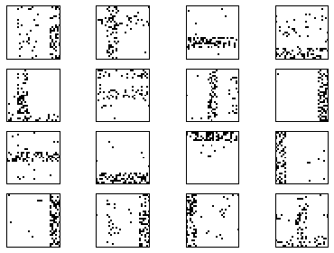
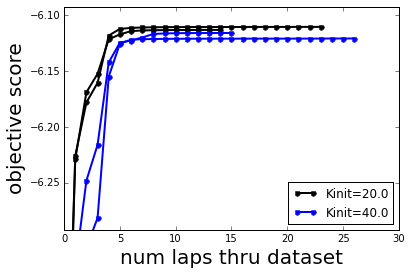
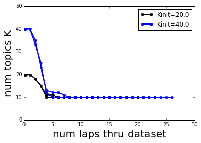
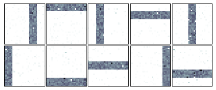
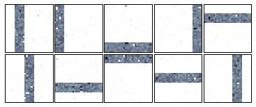

Learning an HDP topic model on Toy Bars Data with merges and deletes
====================================================================

Goal
----

This demo walks you through using **bnpy** from within python to train a
hierarchical Dirichlet process (HDP) topic model on **bag-of-words**
data.

We'll use the memoized variational inference algorithm, with merge and
delete moves.

We can use the following import statements to load bnpy and associated
visualization tools.

.. code:: python

    import bnpy
    
    from matplotlib import pylab
    %pylab inline
    
    imshowArgs = dict(interpolation='nearest', 
                      cmap='bone_r', 
                      vmin=0.0, 
                      vmax=10./900,
                      )

.. parsed-literal::

    Populating the interactive namespace from numpy and matplotlib

Toy dataset : ``BarsK10V900``
-----------------------------

We'll use a simple "toy bars" dataset called ``BarsK10V900``, generated
from the LDA topic model.

**Our intended task here is to assign exactly one topic to every token.
The data was generated this way.**

Be aware that this is different than assigning a single cluster/topic to
the entire document.

.. code:: python

    import BarsK10V900
    Data = BarsK10V900.get_data(nDocTotal=1000, nWordsPerDoc=100)
    Data.name = 'BarsK10V900'
First, we can visualize the 10 "true" bar topics. Each one is a
distribution over 900 vocabulary "words", which are represented here as
individual pixels in a 30x30 image.

.. code:: python

    bnpy.viz.BarsViz.showTopicsAsSquareImages(BarsK10V900.Defaults['topics'], **imshowArgs);

Next, we can visualize some example documents. Here are 16 documents

.. code:: python

    bnpy.viz.BarsViz.plotExampleBarsDocs(Data, nDocToPlot=16, **imshowArgs);

Important keyword options for HDP topic models
----------------------------------------------

--K
~~~

The initial number of topics (aka clusters) is determined by this
integer. For infinite models like the HDP, we can remove topics via
merge and delete moves. These moves alone **cannot** add any topics, so
the initial value of :math:`K` is the upper limit in each run.

--initname
~~~~~~~~~~

This string specifies the initialization procedure for the topic-word
parameters. Here are the options

::

    * kmeansplusplus [Recommended]

Runs kmeans on the empirical document word-count vectors, using the
specified number of clusters :math:`K`.

::

    * randexamples [Default]

Selects :math:`K` documents at random without replacement. Can be bad
because it does not

::

    * randomlikewang

Draws each topic-word variational parameter vector :math:`\tau` as a
Gamma random variable. This is the same procedure used in Wang et al.'s
original Python code for HDP topic models.

.. math::

   \qquad \qquad \tau_{kv} \sim \mbox{Gamma}(100), \forall k,v

--gamma
~~~~~~~

This positive scalar controls the expected number of topics overall.
Usually should be set to a moderate value like 5 or 10.

--alpha
~~~~~~~

This positive scalar controls the sparsity of the document-topic
assignments.

Set this value smaller (like 0.1 or smaller) to encourage more sparsity
in these distributions.

Setting it large (like 10 or 100) will cause all the documents to use
all the topics uniformly, which is bad.

--nCoordAscentItersLP
~~~~~~~~~~~~~~~~~~~~~

This integer specifies how long to run the local "E" step algorithm,
which alternately updates free variational parameters for (1) every
token in the document, and (2) the document-specific topic distribution.

Larger values will let the algorithm converge more, but at the cost of
more computation. Usually setting this to 10 is too small, while 200
would maybe be too large unless there are many many topics.

Important keyword options that control merge moves
--------------------------------------------------

--mergePairSelection
~~~~~~~~~~~~~~~~~~~~

This string specifies the routine we use to identify which pair of
topics to try to merge. Here are options.

::

    * corr [note: not the Default!]

Tracks the empirical correlation coefficient (across all documents)
between the document-topic counts for a given pair of topics. This value
can be in the range from -1 to 1. Positive values close to 1 indicate
promising merge candidates, since the topics are frequently used to
explain the same data.

::

    * corrlimitdegree [note: not the Default]

Like ``corr`` above, but from the set of promising topic pairs selected
using the correlation criterion, we eliminate some so that the total set
of topics involved is more diverse. Specifically, we make sure that the
"degree" of each topic (which we define as the number of selected pairs
it belongs to), is below a small constant. This makes the tracking of
topics more scalable by reducing the size of the set.

--mergePerLap
~~~~~~~~~~~~~

This integer specifies the maximum number of merge moves to try in one
pass through the data. Larger values will be computationally demanding,
but could produce big changes. Generally, we recommend no more than 50
or 100 merge attempts. 25 is probably a good number for toy data.

Again, this is the maximum number. If the selection procedure identifies
only 3 candidate pairs, then only 3 will be tracked.

--mergeStartLap
~~~~~~~~~~~~~~~

This positive integer specifies when we should *start* performing merge
moves. It defaults to 1, which means we start after the first pass
through the data. Setting it to 5 would mean waiting five full passes
before using the merges, which can let the initial configuration evolve
to a decent place and avoid early-lap greedy removal of topics before
they have a chance to improve as much as possible.

--mergeNumStuckBeforeQuit
~~~~~~~~~~~~~~~~~~~~~~~~~

This integer sets the criteria for when to stop a run. It specifies how
many consecutive laps we should have unsuccessful merges before we give
up.

Important keyword options that control DELETE moves
---------------------------------------------------

--dtargetMaxSize [default is not trustworthy, you should set this carefully]
~~~~~~~~~~~~~~~~~~~~~~~~~~~~~~~~~~~~~~~~~~~~~~~~~~~~~~~~~~~~~~~~~~~~~~~~~~~~

Specify the maximuze sie of the target set used for the delete move. For
the HDP topic model, this is measured as the number of documents.

You should be very careful to set this for the dataset at hand. Too
large, and computational effort for a delete proposal may be enormous.
Too small, and you may not be able to delete some junk topics (which are
bigger than this threshold, but still small in absolute sense).

Generally, we recommend setting to 100-1000 documents. Larger is better
performance, but with bigger cost. Using more than 1000 documents with
large number of topics can get very expensive.

--deleteNumFail [default=2 is trustworthy]
~~~~~~~~~~~~~~~~~~~~~~~~~~~~~~~~~~~~~~~~~~

The number of times we can attempt to delete a specific topic before
never targeting that topic again.

Internally, the algorithm tracks how many failed attempts we have at
each topic. If we exceed this threshold, we never try to delete that
topic again. If a topic changes size drastically (e.g. its number of
assigned tokens changes by more than 20% across iterations, we forget
its failures and make it eligible for deletion again.

The default value (2) is quite reasonable, and shouldn't need
user-specific tuning.

Running inference with **bnpy**
===============================

We'll now fit an HDP topic model with a multinomial likelihood, using
memoized variational inference (specified by the ``moVB`` keyword
option).

We'll initialize with many clusters, and use merge/delete moves to
remove unnecessary topics.

Run with 20 initial clusters, repeated for 2 trials.
----------------------------------------------------

.. code:: python

    hmodel, RInfo = bnpy.run(Data, 'HDPTopicModel', 'Mult', 'moVB',
                             moves='merge,delete',
                             mergePerLap=25, mergePairSelection='corr', 
                             mergeNumStuckBeforeQuit=5, mergeStartLap=3,
                             dtargetMaxSize=100,
                             K=20, alpha=0.1, lam=0.1, initname='kmeansplusplus',
                             nLap=50, printEvery=5, nCoordAscentItersLP=25,
                             nTask=2, jobname='demomergedelete-Kinit=20-kmeans')

.. parsed-literal::

    Toy Bars Data with 10 true topics. Each doc uses 1-3 bars.
    Entire Dataset Summary:
      total size: 1000 units
      batch size: 100 units
      num. batches: 10
    Data for Initialization:
      size: 1000 units (documents)
      vocab size: 900
      min    5%   50%   95%   max 
       68    76    85    92    99  nUniqueTokensPerDoc
      100   100   100   100   100  nTotalTokensPerDoc
    Hist of word_count across tokens 
          1      2      3    <10   <100  >=100
       0.84   0.14   0.02    200      0      0
    Hist of unique docs per word type
         <1    <10   <100  <0.20  <0.50 >=0.50
          0      0   0.75   0.25      0      0
    Allocation Model:  HDP model with K=20 active comps. gamma=1.00. alpha=0.10
    Obs. Data  Model:  Multinomial over finite vocabulary.
    Obs. Data  Prior:  Dirichlet over finite vocabulary 
      lam = [ 0.1  0.1] ...
    Learn Alg: moVB
    Trial  1/2 | alg. seed: 1730304 | data order seed: 8541952
    savepath: /results/BarsK10V900/demomergedelete-Kinit=20-kmeans/1
        0.100/50 after      0 sec. | K   20 | ev -6.826832272e+00 |  
        0.200/50 after      0 sec. | K   20 | ev -6.577129385e+00 |  
        0.300/50 after      0 sec. | K   20 | ev -6.477307977e+00 |  
    DELETE 2/2 accepted
    DELETE 3/3 accepted
    DELETE 1/1 accepted
    MERGE 4/4 accepted. ev increased  3.4525e-02
    MERGE 0/0 accepted. 
        5.000/50 after      5 sec. | K   10 | ev -6.112389614e+00 | Ndiff      4.505 
    MERGE 0/0 accepted. 
    MERGE 0/0 accepted. 
    MERGE 0/0 accepted. 
    MERGE 0/0 accepted. 
    MERGE 0/0 accepted. 
       10.000/50 after      6 sec. | K   10 | ev -6.110772920e+00 | Ndiff      0.291 
    MERGE 0/0 accepted. 
    MERGE 0/0 accepted. 
    MERGE 0/0 accepted. 
    MERGE 0/0 accepted. 
    MERGE 0/0 accepted. 
       15.000/50 after      8 sec. | K   10 | ev -6.110695305e+00 | Ndiff      0.066 
    MERGE 0/0 accepted. 
    MERGE 0/0 accepted. 
    MERGE 0/0 accepted. 
    MERGE 0/0 accepted. 
    MERGE 0/0 accepted. 
       20.000/50 after      9 sec. | K   10 | ev -6.110613432e+00 | Ndiff      0.029 
    MERGE 0/0 accepted. 
    MERGE 0/0 accepted. 
    MERGE 0/0 accepted. 
       23.000/50 after     10 sec. | K   10 | ev -6.110580915e+00 | Ndiff      0.007 
    ... done. converged.
    Trial  2/2 | alg. seed: 2125312 | data order seed: 7673856
    savepath: /results/BarsK10V900/demomergedelete-Kinit=20-kmeans/2
        0.100/50 after      0 sec. | K   20 | ev -6.873861427e+00 |  
        0.200/50 after      0 sec. | K   20 | ev -6.560329517e+00 |  
        0.300/50 after      0 sec. | K   20 | ev -6.441097962e+00 |  
    DELETE 2/2 accepted
    DELETED 1 empty comps
    DELETE 2/2 accepted
    DELETE 1/1 accepted
    MERGE 3/3 accepted. ev increased  2.2972e-02
    MERGE 0/0 accepted. 
        5.000/50 after      4 sec. | K   11 | ev -6.117262888e+00 | Ndiff     19.023 
    DELETE 1/1 accepted
    MERGE 0/0 accepted. 
    MERGE 0/0 accepted. 
    MERGE 0/0 accepted. 
    MERGE 0/0 accepted. 
    MERGE 0/0 accepted. 
       10.000/50 after      6 sec. | K   10 | ev -6.113386818e+00 | Ndiff      0.916 
    MERGE 0/0 accepted. 
    MERGE 0/0 accepted. 
    MERGE 0/0 accepted. 
    MERGE 0/0 accepted. 
       14.000/50 after      7 sec. | K   10 | ev -6.113295094e+00 | Ndiff      0.008 
    ... done. converged.

Run with 40 initial clusters, repeated for two trials
-----------------------------------------------------

.. code:: python

    hmodel, RInfo = bnpy.run(Data, 'HDPTopicModel', 'Mult', 'moVB',
                             moves='merge,delete',
                             mergePerLap=25, mergePairSelection='corr', 
                             mergeNumStuckBeforeQuit=5, mergeStartLap=3,
                             dtargetMaxSize=100,
                             K=40, alpha=0.1, lam=0.1, initname='kmeansplusplus',
                             nLap=50, printEvery=5, nCoordAscentItersLP=25,
                             nTask=2, jobname='demomergedelete-Kinit=40-kmeans')

.. parsed-literal::

    Toy Bars Data with 10 true topics. Each doc uses 1-3 bars.
    Entire Dataset Summary:
      total size: 1000 units
      batch size: 100 units
      num. batches: 10
    Data for Initialization:
      size: 1000 units (documents)
      vocab size: 900
      min    5%   50%   95%   max 
       68    76    85    92    99  nUniqueTokensPerDoc
      100   100   100   100   100  nTotalTokensPerDoc
    Hist of word_count across tokens 
          1      2      3    <10   <100  >=100
       0.84   0.14   0.02    200      0      0
    Hist of unique docs per word type
         <1    <10   <100  <0.20  <0.50 >=0.50
          0      0   0.75   0.25      0      0
    Allocation Model:  HDP model with K=40 active comps. gamma=1.00. alpha=0.10
    Obs. Data  Model:  Multinomial over finite vocabulary.
    Obs. Data  Prior:  Dirichlet over finite vocabulary 
      lam = [ 0.1  0.1] ...
    Learn Alg: moVB
    Trial  1/2 | alg. seed: 1730304 | data order seed: 8541952
    savepath: /results/BarsK10V900/demomergedelete-Kinit=40-kmeans/1
        0.100/50 after      0 sec. | K   40 | ev -7.125462642e+00 |  
        0.200/50 after      0 sec. | K   40 | ev -6.835502157e+00 |  
        0.300/50 after      1 sec. | K   40 | ev -6.702812677e+00 |  
    DELETED 3 empty comps
    DELETE 4/4 accepted
    DELETED 4 empty comps
    DELETE 4/4 accepted
    DELETE 3/3 accepted
    MERGE 10/10 accepted. ev increased  1.1177e-01
    MERGE 2/2 accepted. ev increased  1.3788e-02
        5.000/50 after      8 sec. | K   10 | ev -6.125541990e+00 | Ndiff     16.148 
    MERGE 0/0 accepted. 
    MERGE 0/0 accepted. 
    MERGE 0/0 accepted. 
    MERGE 0/0 accepted. 
    MERGE 0/0 accepted. 
       10.000/50 after     11 sec. | K   10 | ev -6.121223288e+00 | Ndiff      0.325 
    MERGE 0/0 accepted. 
    MERGE 0/0 accepted. 
    MERGE 0/0 accepted. 
    MERGE 0/0 accepted. 
    MERGE 0/0 accepted. 
       15.000/50 after     12 sec. | K   10 | ev -6.121112266e+00 | Ndiff      0.030 
    MERGE 0/0 accepted. 
    MERGE 0/0 accepted. 
    MERGE 0/0 accepted. 
    MERGE 0/0 accepted. 
    MERGE 0/0 accepted. 
       20.000/50 after     14 sec. | K   10 | ev -6.121078540e+00 | Ndiff      0.097 
    MERGE 0/0 accepted. 
    MERGE 0/0 accepted. 
    MERGE 0/0 accepted. 
    MERGE 0/0 accepted. 
    MERGE 0/0 accepted. 
       25.000/50 after     16 sec. | K   10 | ev -6.120959711e+00 | Ndiff      0.082 
    MERGE 0/0 accepted. 
       26.000/50 after     16 sec. | K   10 | ev -6.120959653e+00 | Ndiff      0.003 
    ... done. converged.
    Trial  2/2 | alg. seed: 2125312 | data order seed: 7673856
    savepath: /results/BarsK10V900/demomergedelete-Kinit=40-kmeans/2
        0.100/50 after      0 sec. | K   40 | ev -7.137426078e+00 |  
        0.200/50 after      0 sec. | K   40 | ev -6.749066825e+00 |  
        0.300/50 after      0 sec. | K   40 | ev -6.594770838e+00 |  
    DELETE 5/5 accepted
    DELETED 6 empty comps
    DELETE 6/6 accepted
    DELETED 1 empty comps
    DELETE 2/2 accepted
    MERGE 7/7 accepted. ev increased  6.2589e-02
    MERGE 1/1 accepted. ev increased  6.8775e-03
        5.000/50 after      7 sec. | K   12 | ev -6.124634018e+00 | Ndiff      7.627 
    MERGE 0/0 accepted. 
    DELETE 1/1 accepted
    MERGE 0/0 accepted. 
    DELETE 1/1 accepted
    MERGE 0/0 accepted. 
    MERGE 0/0 accepted. 
    MERGE 0/0 accepted. 
       10.000/50 after      9 sec. | K   10 | ev -6.116230050e+00 | Ndiff      0.467 
    MERGE 0/0 accepted. 
    MERGE 0/0 accepted. 
    MERGE 0/0 accepted. 
    MERGE 0/0 accepted. 
    MERGE 0/0 accepted. 
       15.000/50 after     10 sec. | K   10 | ev -6.116040914e+00 | Ndiff      0.006 
    ... done. converged.

Compare the objective function over time
----------------------------------------

.. code:: python

    bnpy.viz.PlotELBO.plotJobsThatMatchKeywords('BarsK10V900/demomergedelete-*');
    pylab.ylabel('objective score', fontsize=20);
    pylab.xlabel('num laps thru dataset', fontsize=20);
    pylab.legend(loc='lower right');

**Conclusion:** merge/delete moves can take models from very different
initial values, and find similar final scores.

Compare the number of topics over time
--------------------------------------

.. code:: python

    bnpy.viz.PlotK.plotJobsThatMatchKeywords('BarsK10V900/demomergedelete-*', yvar='K');
    pylab.ylim([0, 50]); pylab.ylabel('num topics K', fontsize=20);
    pylab.xlabel('num laps thru dataset', fontsize=20);

Final learned topic-word parameters from :math:`K=20` initial topics
~~~~~~~~~~~~~~~~~~~~~~~~~~~~~~~~~~~~~~~~~~~~~~~~~~~~~~~~~~~~~~~~~~~~

.. code:: python

    bnpy.viz.PlotComps.plotCompsForTask('BarsK10V900/demomergedelete-Kinit=20-kmeans/1/', **imshowArgs)

**Conclusion**: We successfully merge/delete from 20 topics down to the
true 10 bars.

Final learned topic-word parameters from :math:`K=40` initial topics
~~~~~~~~~~~~~~~~~~~~~~~~~~~~~~~~~~~~~~~~~~~~~~~~~~~~~~~~~~~~~~~~~~~~

.. code:: python

    bnpy.viz.PlotComps.plotCompsForTask('BarsK10V900/demomergedelete-Kinit=40-kmeans/1/', **imshowArgs)

**Conclusion**: We successfully merge/delete from 40 topics down to the
true 10 bars.
