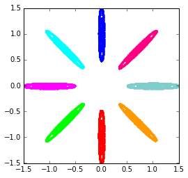
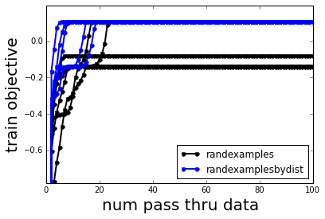
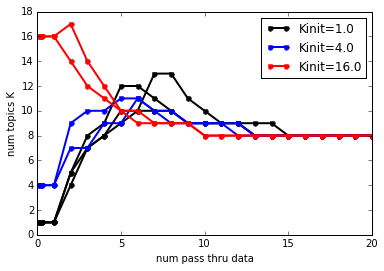
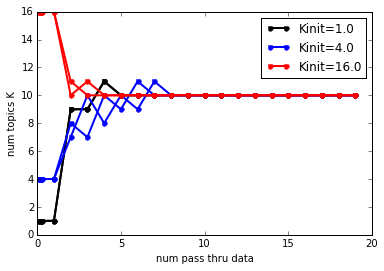
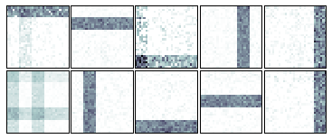
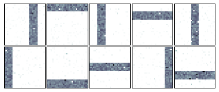

=====================
Demo Gallery
=====================

Gaussian Toy Data Demos
=======================

`EM for finite mixture model <./GaussianToyData-FiniteMixtureModel-EM.html>`__
-----------------------------

.. raw:: html

	

	

	

	
	

	

	Quick hello-world example for beginners.
	

	

	

`EM for finite mixture model <./GaussianToyData-FiniteMixtureModel-EM.html>`__
-------------------------------------------------------------------------------

A quick hello world example for beginners to **bnpy**.

`Why initialization matters <./GaussianToyData-ExperimentalComparisonOfInitialization.html>`__
-----------------------------------------------------------------------------------------------

Experiment showing how **bnpy** makes it easy to compare different
initialization routines across many algorithm runs.

`Births and merges inference for DP mixtures of Gaussians <./GaussianToyData-DPMixtureModel-MemoizedWithBirthsAndMerges.html>`__
---------------------------------------------------------------------------------------------------------------------------------

Experiment showing how births and merges can find the ideal set of
clusters, no matter how many we have initially.

Bag-of-words Toy Data Demos
===========================

.. image:: DemoIndex_files/DemoIndex_10_0.png

`Birth and merge inference for DP mixtures of Multinomials <./BarsToyData-DPMixtureModel-MemoizedWithBirthsAndMerges.html>`__
------------------------------------------------------------------------------------------------------------------------------

Experiment showing how births and merges add and remove clusters to find
the ideal set of bars.

`Latent Dirichlet Allocation topic modeling with variational inference <./BarsToyData-FiniteTopicModel-Variational.html>`__
----------------------------------------------------------------------------------------------------------------------------

Experiment shows the basics for training a topic model, comparing
different number of topics.

`Merge and delete moves with HDP topic models <./BarsToyData-HDPTopicModel-VariationalWithMergeDelete.html>`__
---------------------------------------------------------------------------------------------------------------

Use merge and delete moves for topic models to identify the 10 true bars
topics from initializations with many more.

