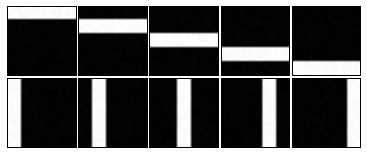

=====================
Demo Gallery
=====================

Gaussian Toy Data Demos
=======================

.. raw:: html

	

	

	

		
	

	

		<a href="GaussianToyData-FiniteMixtureModel-EM-SingleRunDemo.html">
		<h3 class="media-heading">
		Simple Gaussian mixture model on toy data
		</h3>
		</a>
		

		Easy "hello-world" example for beginners to bnpy. Learn how to train a model and plot the results.
		

	

	

	

	

	

	

		
	

	

		<a href="GaussianToyData-FiniteMixtureModel-EM-CompareInitialization.html">
		<h3 class="media-heading">
		Comparison of initialization methods for Gaussian mixtures
		</h3>
		</a>
		

		Learn how to specify the initialization procedure and why all variational methods (from EM to memoized) are sensitive to this choice.
		

	

	

	

	

	

	

		
	

	

		<a href="GaussianToyData-DPMixtureModel-MemoizedWithBirthsAndMerges.html">
		<h3 class="media-heading">
		Birth and merge inference for DP mixtures of Gaussians
		</h3>
		</a>
		

		Experiment showing how bnpy's state-of-the-art birth and merge moves can find the ideal set of clusters, no matter how many we have initially.
		

	

	

	

Bag-of-words Toy Data Demos
===========================

`Birth and merge inference for DP mixtures of Multinomials <./BarsToyData-DPMixtureModel-MemoizedWithBirthsAndMerges.html>`__
------------------------------------------------------------------------------------------------------------------------------

Experiment showing how births and merges add and remove clusters to find
the ideal set of bars.

.. image:: DemoIndex_files/DemoIndex_12_0.png

`Latent Dirichlet Allocation topic modeling with variational inference <./BarsToyData-FiniteTopicModel-Variational.html>`__
----------------------------------------------------------------------------------------------------------------------------

Experiment shows the basics for training a topic model, comparing
different number of topics.

.. image:: DemoIndex_files/DemoIndex_14_0.png

`Merge and delete moves with HDP topic models <./BarsToyData-HDPTopicModel-VariationalWithMergeDelete.html>`__
---------------------------------------------------------------------------------------------------------------

Use merge and delete moves for topic models to identify the 10 true bars
topics from initializations with many more.

.. image:: DemoIndex_files/DemoIndex_16_0.png
