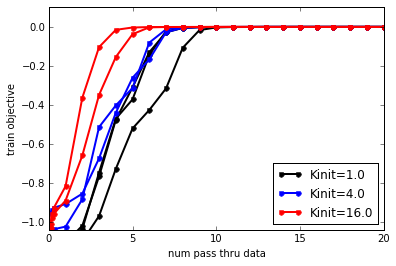
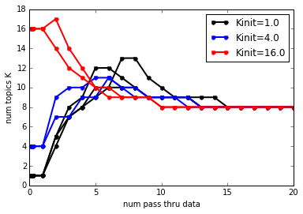
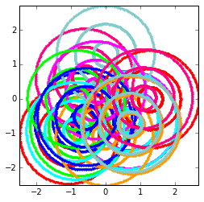
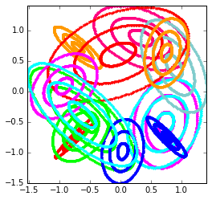

Learning DP Gaussian Mixtures on Toy Data with Birth and Merge moves
====================================================================

Goal
----

This demo walks you through a "Hello World" example of using **bnpy**
from within Python.

We'll train a Dirichlet process (DP) Gaussian mixture model using
memoized variational inference.

We can use the following import statements to load bnpy.

.. code:: python

    import bnpy
Toy dataset : ``AsteriskK8``
----------------------------

We'll use a simple dataset of 2D points, drawn from 8 well-separated
Gaussian clusters.

Our goal will be to recover the true set of 8 clusters.

.. code:: python

    import AsteriskK8
    Data = AsteriskK8.get_data()
We can visualize this dataset as follows:

.. code:: python

    from matplotlib import pylab
    %pylab inline

.. parsed-literal::

    Populating the interactive namespace from numpy and matplotlib

.. code:: python

    pylab.plot(Data.X[:,0], Data.X[:,1], 'k.');
    pylab.gcf().set_size_inches(4, 4);
    pylab.axis('image'); pylab.xlim([-1.75, 1.75]); pylab.ylim([-1.75, 1.75]);

.. image:: GaussianToyData-DPMixtureModel-MemoizedWithBirthsAndMerges_files/GaussianToyData-DPMixtureModel-MemoizedWithBirthsAndMerges_8_0.png

Running inference with **bnpy**
===============================

We'll fit a DP Gaussian mixture model, using birth and merge moves. We
use the ``moves`` keyword argument to specify which moves to employ.

We'll look at several possible initial numbers of clusters, and show
that the birth/merge moves consistently reach the ideal set of 8
clusters.

1 initial cluster, repeated for 2 trials
----------------------------------------

.. code:: python

    hmodel, RInfo = bnpy.run('AsteriskK8', 'DPMixtureModel', 'Gauss', 'moVB',
                             nLap=20, K=1, moves='birth,merge', 
                             nTask=2, jobname='demobirthmerge-Kinit=1')

.. parsed-literal::

    Asterisk Toy Data. 8 true clusters.
    Entire Dataset Summary:
      total size: 25000 units
      batch size: 2500 units
      num. batches: 10
    Data for Initialization:
      size: 25000 units (single observations)
      dimension: 2
    Allocation Model:  DP mixture with K=1. Concentration gamma0= 1.00
    Obs. Data  Model:  Gaussian with full covariance.
    Obs. Data  Prior:  Gauss-Wishart on each mean/prec matrix pair: mu, Lam
      E[ mu[k] ]     = [ 0.  0.]
      E[ CovMat[k] ] = 
      [[ 1.  0.]
       [ 0.  1.]]
    Learn Alg: moVB
    Trial  1/2 | alg. seed: 2497280 | data order seed: 8541952
    savepath: /results/AsteriskK8/demobirthmerge-Kinit=1/1
        0.100/20 after      0 sec. | K    1 | ev -1.108127377e+00 |  
        0.200/20 after      0 sec. | K    1 | ev -1.108663274e+00 |  
        0.300/20 after      0 sec. | K    1 | ev -1.110766628e+00 |  
        1.000/20 after      0 sec. | K    1 | ev -1.104282665e+00 |  
    BIRTH ACCEPTED. 4 fresh comps.
    MERGE 0/3 accepted. 
        2.000/20 after      0 sec. | K    5 | ev -1.016891994e+00 | Ndiff    545.066 
    BIRTH ACCEPTED. 3 fresh comps.
    MERGE 0/5 accepted. 
        3.000/20 after      1 sec. | K    8 | ev -7.642300722e-01 | Ndiff   1068.284 
    BIRTH ACCEPTED. 4 fresh comps.
    MERGE 3/8 accepted. ev increased  1.9837e-03
        4.000/20 after      1 sec. | K    9 | ev -4.743017979e-01 | Ndiff   1032.489 
    BIRTH ACCEPTED. 5 fresh comps.
    MERGE 2/9 accepted. ev increased  2.5825e-03
        5.000/20 after      2 sec. | K   12 | ev -3.074946741e-01 | Ndiff    412.162 
    BIRTH ACCEPTED. 4 fresh comps.
    MERGE 4/5 accepted. ev increased  1.3074e-02
        6.000/20 after      2 sec. | K   12 | ev -1.276881407e-01 | Ndiff    277.107 
    BIRTH ACCEPTED. 4 fresh comps.
    MERGE 5/7 accepted. ev increased  4.9037e-03
        7.000/20 after      3 sec. | K   11 | ev -2.572591276e-02 | Ndiff    216.745 
    MERGE 1/1 accepted. ev increased  4.6030e-04
        8.000/20 after      3 sec. | K   10 | ev -2.584905797e-03 | Ndiff     39.118 
    MERGE 1/1 accepted. ev increased  3.2250e-04
        9.000/20 after      3 sec. | K    9 | ev  1.109397198e-03 | Ndiff     12.643 
    MERGE 0/0 accepted. 
       10.000/20 after      3 sec. | K    9 | ev  1.803132779e-03 | Ndiff      4.367 
    MERGE 0/0 accepted. 
       11.000/20 after      3 sec. | K    9 | ev  1.996103141e-03 | Ndiff      0.794 
    MERGE 0/0 accepted. 
       12.000/20 after      4 sec. | K    9 | ev  2.072616626e-03 | Ndiff      0.198 
    MERGE 1/1 accepted. ev increased  2.0252e-04
       13.000/20 after      4 sec. | K    8 | ev  2.408926998e-03 | Ndiff      0.017 
    MERGE 0/0 accepted. 
       14.000/20 after      4 sec. | K    8 | ev  2.408927530e-03 | Ndiff      0.000 
    MERGE 0/0 accepted. 
       15.000/20 after      4 sec. | K    8 | ev  2.408927530e-03 | Ndiff      0.000 
    MERGE 0/0 accepted. 
       16.000/20 after      4 sec. | K    8 | ev  2.408927530e-03 | Ndiff      0.000 
    MERGE 0/0 accepted. 
       17.000/20 after      4 sec. | K    8 | ev  2.408927530e-03 | Ndiff      0.000 
    MERGE 0/0 accepted. 
       18.000/20 after      5 sec. | K    8 | ev  2.408927530e-03 | Ndiff      0.000 
    MERGE 0/0 accepted. 
       19.000/20 after      5 sec. | K    8 | ev  2.408927530e-03 | Ndiff      0.000 
    MERGE 0/0 accepted. 
       20.000/20 after      5 sec. | K    8 | ev  2.408927530e-03 | Ndiff      0.000 
    ... done. converged.
    Trial  2/2 | alg. seed: 1128064 | data order seed: 7673856
    savepath: /results/AsteriskK8/demobirthmerge-Kinit=1/2
        0.100/20 after      0 sec. | K    1 | ev -1.106116048e+00 |  
        0.200/20 after      0 sec. | K    1 | ev -1.106848843e+00 |  
        0.300/20 after      0 sec. | K    1 | ev -1.107106005e+00 |  
        1.000/20 after      0 sec. | K    1 | ev -1.104282665e+00 |  
    BIRTH ACCEPTED. 4 fresh comps.
    MERGE 0/3 accepted. 
        2.000/20 after      0 sec. | K    5 | ev -1.034087643e+00 | Ndiff    461.926 
    BIRTH ACCEPTED. 3 fresh comps.
    MERGE 1/5 accepted. ev increased  8.4192e-05
        3.000/20 after      1 sec. | K    7 | ev -7.444108143e-01 | Ndiff   1080.763 
    BIRTH ACCEPTED. 3 fresh comps.
    MERGE 2/6 accepted. ev increased  4.4727e-03
        4.000/20 after      1 sec. | K    8 | ev -4.684278566e-01 | Ndiff    632.104 
    BIRTH ACCEPTED. 3 fresh comps.
    MERGE 1/6 accepted. ev increased  2.8012e-04
        5.000/20 after      1 sec. | K   10 | ev -3.695900973e-01 | Ndiff    352.647 
    BIRTH ACCEPTED. 4 fresh comps.
    MERGE 4/7 accepted. ev increased  3.7992e-03
        6.000/20 after      2 sec. | K   10 | ev -1.409357981e-01 | Ndiff    284.190 
    BIRTH ACCEPTED. 3 fresh comps.
    MERGE 3/5 accepted. ev increased  1.0351e-02
        7.000/20 after      2 sec. | K   10 | ev -2.126028050e-02 | Ndiff    130.023 
    MERGE 0/1 accepted. 
        8.000/20 after      2 sec. | K   10 | ev -2.017934874e-03 | Ndiff     47.118 
    MERGE 1/1 accepted. ev increased  1.3809e-04
        9.000/20 after      2 sec. | K    9 | ev  1.113776726e-03 | Ndiff     16.418 
    MERGE 0/0 accepted. 
       10.000/20 after      3 sec. | K    9 | ev  1.808072227e-03 | Ndiff      2.962 
    MERGE 0/0 accepted. 
       11.000/20 after      3 sec. | K    9 | ev  1.993362590e-03 | Ndiff      0.700 
    MERGE 0/0 accepted. 
       12.000/20 after      3 sec. | K    9 | ev  2.067939012e-03 | Ndiff      0.110 
    MERGE 1/1 accepted. ev increased  2.0341e-04
       13.000/20 after      3 sec. | K    8 | ev  2.409556966e-03 | Ndiff      0.007 
    MERGE 0/0 accepted. 
       14.000/20 after      3 sec. | K    8 | ev  2.409564246e-03 | Ndiff      0.000 
    MERGE 0/0 accepted. 
       15.000/20 after      3 sec. | K    8 | ev  2.409564246e-03 | Ndiff      0.000 
    MERGE 0/0 accepted. 
       16.000/20 after      4 sec. | K    8 | ev  2.409564246e-03 | Ndiff      0.000 
    MERGE 0/0 accepted. 
       17.000/20 after      4 sec. | K    8 | ev  2.409564246e-03 | Ndiff      0.000 
    MERGE 0/0 accepted. 
       18.000/20 after      4 sec. | K    8 | ev  2.409564246e-03 | Ndiff      0.000 
    MERGE 0/0 accepted. 
       19.000/20 after      4 sec. | K    8 | ev  2.409564246e-03 | Ndiff      0.000 
    MERGE 0/0 accepted. 
       20.000/20 after      4 sec. | K    8 | ev  2.409564246e-03 | Ndiff      0.000 
    ... done. converged.

4 initial clusters, repeated for 2 trials
-----------------------------------------

.. code:: python

    hmodel, RInfo = bnpy.run('AsteriskK8', 'DPMixtureModel', 'Gauss', 'moVB',
                             nLap=20, K=4, moves='birth,merge',
                             nTask=2, jobname='demobirthmerge-Kinit=4')

.. parsed-literal::

    Asterisk Toy Data. 8 true clusters.
    Entire Dataset Summary:
      total size: 25000 units
      batch size: 2500 units
      num. batches: 10
    Data for Initialization:
      size: 25000 units (single observations)
      dimension: 2
    Allocation Model:  DP mixture with K=4. Concentration gamma0= 1.00
    Obs. Data  Model:  Gaussian with full covariance.
    Obs. Data  Prior:  Gauss-Wishart on each mean/prec matrix pair: mu, Lam
      E[ mu[k] ]     = [ 0.  0.]
      E[ CovMat[k] ] = 
      [[ 1.  0.]
       [ 0.  1.]]
    Learn Alg: moVB
    Trial  1/2 | alg. seed: 2497280 | data order seed: 8541952
    savepath: /results/AsteriskK8/demobirthmerge-Kinit=4/1
        0.100/20 after      0 sec. | K    4 | ev -1.047304800e+00 |  
        0.200/20 after      0 sec. | K    4 | ev -1.036752818e+00 |  
        0.300/20 after      0 sec. | K    4 | ev -1.034697291e+00 |  
        1.000/20 after      0 sec. | K    4 | ev -1.021824496e+00 |  
    BIRTH ACCEPTED. 5 fresh comps.
    MERGE 0/10 accepted. 
        2.000/20 after      0 sec. | K    9 | ev -8.816303504e-01 | Ndiff    563.551 
    BIRTH ACCEPTED. 3 fresh comps.
    MERGE 2/6 accepted. ev increased  2.6682e-03
        3.000/20 after      1 sec. | K   10 | ev -5.113303580e-01 | Ndiff    472.360 
    BIRTH ACCEPTED. 4 fresh comps.
    MERGE 4/5 accepted. ev increased  2.1211e-03
        4.000/20 after      1 sec. | K   10 | ev -4.002681731e-01 | Ndiff    346.902 
    BIRTH ACCEPTED. 3 fresh comps.
    MERGE 2/6 accepted. ev increased  7.8694e-04
        5.000/20 after      2 sec. | K   11 | ev -3.113172387e-01 | Ndiff    339.691 
    BIRTH ACCEPTED. 2 fresh comps.
    MERGE 2/3 accepted. ev increased  3.7824e-03
        6.000/20 after      2 sec. | K   11 | ev -7.822969648e-02 | Ndiff    169.558 
    MERGE 1/1 accepted. ev increased  6.1792e-04
        7.000/20 after      2 sec. | K   10 | ev -1.036240544e-02 | Ndiff    112.482 
    MERGE 1/1 accepted. ev increased  4.2725e-04
        8.000/20 after      3 sec. | K    9 | ev  2.697950188e-04 | Ndiff     27.357 
    MERGE 0/0 accepted. 
        9.000/20 after      3 sec. | K    9 | ev  1.646967412e-03 | Ndiff      5.863 
    MERGE 0/0 accepted. 
       10.000/20 after      3 sec. | K    9 | ev  1.920246795e-03 | Ndiff      0.956 
    MERGE 0/0 accepted. 
       11.000/20 after      3 sec. | K    9 | ev  2.001534235e-03 | Ndiff      0.188 
    MERGE 1/1 accepted. ev increased  2.2118e-04
       12.000/20 after      3 sec. | K    8 | ev  2.350332795e-03 | Ndiff      0.014 
    MERGE 0/0 accepted. 
       13.000/20 after      4 sec. | K    8 | ev  2.350562004e-03 | Ndiff      0.000 
    MERGE 0/0 accepted. 
       14.000/20 after      4 sec. | K    8 | ev  2.350562004e-03 | Ndiff      0.000 
    MERGE 0/0 accepted. 
       15.000/20 after      4 sec. | K    8 | ev  2.350562004e-03 | Ndiff      0.000 
    MERGE 0/0 accepted. 
       16.000/20 after      4 sec. | K    8 | ev  2.350562004e-03 | Ndiff      0.000 
    MERGE 0/0 accepted. 
       17.000/20 after      4 sec. | K    8 | ev  2.350562004e-03 | Ndiff      0.000 
    MERGE 0/0 accepted. 
       18.000/20 after      4 sec. | K    8 | ev  2.350562004e-03 | Ndiff      0.000 
    MERGE 0/0 accepted. 
       19.000/20 after      5 sec. | K    8 | ev  2.350562004e-03 | Ndiff      0.000 
    MERGE 0/0 accepted. 
       20.000/20 after      5 sec. | K    8 | ev  2.350562004e-03 | Ndiff      0.000 
    ... done. converged.
    Trial  2/2 | alg. seed: 1128064 | data order seed: 7673856
    savepath: /results/AsteriskK8/demobirthmerge-Kinit=4/2
        0.100/20 after      0 sec. | K    4 | ev -9.495577494e-01 |  
        0.200/20 after      0 sec. | K    4 | ev -9.343023972e-01 |  
        0.300/20 after      0 sec. | K    4 | ev -9.250155247e-01 |  
        1.000/20 after      0 sec. | K    4 | ev -9.060052809e-01 |  
    BIRTH ACCEPTED. 3 fresh comps.
    MERGE 0/5 accepted. 
        2.000/20 after      0 sec. | K    7 | ev -8.527296815e-01 | Ndiff    327.295 
    BIRTH ACCEPTED. 3 fresh comps.
    MERGE 3/6 accepted. ev increased  9.5830e-03
        3.000/20 after      1 sec. | K    7 | ev -6.718527761e-01 | Ndiff    494.004 
    BIRTH ACCEPTED. 3 fresh comps.
    MERGE 1/5 accepted. ev increased  6.1158e-04
        4.000/20 after      1 sec. | K    9 | ev -4.378927182e-01 | Ndiff    386.498 
    BIRTH ACCEPTED. 2 fresh comps.
    MERGE 2/3 accepted. ev increased  6.5918e-03
        5.000/20 after      1 sec. | K    9 | ev -2.584362805e-01 | Ndiff    162.352 
    BIRTH ACCEPTED. 2 fresh comps.
    MERGE 0/2 accepted. 
        6.000/20 after      1 sec. | K   11 | ev -1.643085956e-01 | Ndiff    465.042 
    BIRTH ACCEPTED. 2 fresh comps.
    MERGE 3/3 accepted. ev increased  6.1574e-03
        7.000/20 after      2 sec. | K   10 | ev -2.531009200e-02 | Ndiff    195.879 
    MERGE 0/0 accepted. 
        8.000/20 after      2 sec. | K   10 | ev -2.217996816e-03 | Ndiff     47.799 
    MERGE 1/1 accepted. ev increased  3.7208e-04
        9.000/20 after      2 sec. | K    9 | ev  1.343588569e-03 | Ndiff     13.117 
    MERGE 0/0 accepted. 
       10.000/20 after      2 sec. | K    9 | ev  1.896451034e-03 | Ndiff      1.319 
    MERGE 0/0 accepted. 
       11.000/20 after      3 sec. | K    9 | ev  2.011138803e-03 | Ndiff      0.291 
    MERGE 0/0 accepted. 
       12.000/20 after      3 sec. | K    9 | ev  2.120211961e-03 | Ndiff      0.020 
    MERGE 1/1 accepted. ev increased  1.9889e-04
       13.000/20 after      3 sec. | K    8 | ev  2.369082970e-03 | Ndiff      0.000 
    MERGE 0/0 accepted. 
       14.000/20 after      3 sec. | K    8 | ev  2.369082970e-03 | Ndiff      0.000 
    MERGE 0/0 accepted. 
       15.000/20 after      4 sec. | K    8 | ev  2.369082970e-03 | Ndiff      0.000 
    MERGE 0/0 accepted. 
       16.000/20 after      4 sec. | K    8 | ev  2.369082970e-03 | Ndiff      0.000 
    MERGE 0/0 accepted. 
       17.000/20 after      4 sec. | K    8 | ev  2.369082970e-03 | Ndiff      0.000 
    MERGE 0/0 accepted. 
       18.000/20 after      4 sec. | K    8 | ev  2.369082970e-03 | Ndiff      0.000 
    MERGE 0/0 accepted. 
       19.000/20 after      4 sec. | K    8 | ev  2.369082970e-03 | Ndiff      0.000 
    MERGE 0/0 accepted. 
       20.000/20 after      5 sec. | K    8 | ev  2.369082970e-03 | Ndiff      0.000 
    ... done. converged.

16 initial clusters, repeated for 2 trials
------------------------------------------

.. code:: python

    hmodel, RInfo = bnpy.run('AsteriskK8', 'DPMixtureModel', 'Gauss', 'moVB',
                             nLap=20, K=16, moves='birth,merge',
                             nTask=2, jobname='demobirthmerge-Kinit=16')

.. parsed-literal::

    Asterisk Toy Data. 8 true clusters.
    Entire Dataset Summary:
      total size: 25000 units
      batch size: 2500 units
      num. batches: 10
    Data for Initialization:
      size: 25000 units (single observations)
      dimension: 2
    Allocation Model:  DP mixture with K=16. Concentration gamma0= 1.00
    Obs. Data  Model:  Gaussian with full covariance.
    Obs. Data  Prior:  Gauss-Wishart on each mean/prec matrix pair: mu, Lam
      E[ mu[k] ]     = [ 0.  0.]
      E[ CovMat[k] ] = 
      [[ 1.  0.]
       [ 0.  1.]]
    Learn Alg: moVB
    Trial  1/2 | alg. seed: 2497280 | data order seed: 8541952
    savepath: /results/AsteriskK8/demobirthmerge-Kinit=16/1
        0.100/20 after      0 sec. | K   16 | ev -1.027305690e+00 |  
        0.200/20 after      0 sec. | K   16 | ev -9.753695193e-01 |  
        0.300/20 after      0 sec. | K   16 | ev -9.560752456e-01 |  
        1.000/20 after      0 sec. | K   16 | ev -8.879254976e-01 |  
    BIRTH ACCEPTED. 2 fresh comps.
    MERGE 4/16 accepted. ev increased  2.9864e-03
        2.000/20 after      1 sec. | K   14 | ev -6.570084469e-01 | Ndiff    209.941 
    BIRTH ACCEPTED. 2 fresh comps.
    MERGE 4/8 accepted. ev increased  6.6230e-03
        3.000/20 after      1 sec. | K   12 | ev -3.465047823e-01 | Ndiff    207.696 
    MERGE 1/4 accepted. ev increased  5.9019e-04
        4.000/20 after      2 sec. | K   11 | ev -1.522618031e-01 | Ndiff    240.370 
    MERGE 1/2 accepted. ev increased  2.5773e-03
        5.000/20 after      2 sec. | K   10 | ev -3.498169425e-02 | Ndiff     31.836 
    MERGE 0/0 accepted. 
        6.000/20 after      2 sec. | K   10 | ev  2.837920014e-04 | Ndiff     20.621 
    MERGE 1/1 accepted. ev increased  3.5597e-04
        7.000/20 after      2 sec. | K    9 | ev  1.688624507e-03 | Ndiff      3.199 
    MERGE 0/0 accepted. 
        8.000/20 after      2 sec. | K    9 | ev  1.926058924e-03 | Ndiff      1.694 
    MERGE 0/0 accepted. 
        9.000/20 after      3 sec. | K    9 | ev  2.006017744e-03 | Ndiff      0.184 
    MERGE 1/1 accepted. ev increased  2.1958e-04
       10.000/20 after      3 sec. | K    8 | ev  2.353395676e-03 | Ndiff      0.010 
    MERGE 0/0 accepted. 
       11.000/20 after      3 sec. | K    8 | ev  2.353688739e-03 | Ndiff      0.000 
    MERGE 0/0 accepted. 
       12.000/20 after      3 sec. | K    8 | ev  2.353688739e-03 | Ndiff      0.000 
    MERGE 0/0 accepted. 
       13.000/20 after      3 sec. | K    8 | ev  2.353688739e-03 | Ndiff      0.000 
    MERGE 0/0 accepted. 
       14.000/20 after      4 sec. | K    8 | ev  2.353688739e-03 | Ndiff      0.000 
    MERGE 0/0 accepted. 
       15.000/20 after      4 sec. | K    8 | ev  2.353688739e-03 | Ndiff      0.000 
    MERGE 0/0 accepted. 
       16.000/20 after      4 sec. | K    8 | ev  2.353688739e-03 | Ndiff      0.000 
    MERGE 0/0 accepted. 
       17.000/20 after      4 sec. | K    8 | ev  2.353688739e-03 | Ndiff      0.000 
    MERGE 0/0 accepted. 
       18.000/20 after      4 sec. | K    8 | ev  2.353688739e-03 | Ndiff      0.000 
    MERGE 0/0 accepted. 
       19.000/20 after      4 sec. | K    8 | ev  2.353688739e-03 | Ndiff      0.000 
    MERGE 0/0 accepted. 
       20.000/20 after      5 sec. | K    8 | ev  2.353688739e-03 | Ndiff      0.000 
    ... done. converged.
    Trial  2/2 | alg. seed: 1128064 | data order seed: 7673856
    savepath: /results/AsteriskK8/demobirthmerge-Kinit=16/2
        0.100/20 after      0 sec. | K   16 | ev -1.006223491e+00 |  
        0.200/20 after      0 sec. | K   16 | ev -9.547728942e-01 |  
        0.300/20 after      0 sec. | K   16 | ev -9.252499010e-01 |  
        1.000/20 after      0 sec. | K   16 | ev -8.145731669e-01 |  
    BIRTH ACCEPTED. 3 fresh comps.
    MERGE 2/18 accepted. ev increased  6.9098e-04
        2.000/20 after      1 sec. | K   17 | ev -3.607285169e-01 | Ndiff    103.212 
    MERGE 3/10 accepted. ev increased  9.3908e-03
        3.000/20 after      1 sec. | K   14 | ev -1.012415763e-01 | Ndiff    230.897 
    MERGE 2/2 accepted. ev increased  7.2418e-04
        4.000/20 after      1 sec. | K   12 | ev -1.275171392e-02 | Ndiff    110.627 
    MERGE 2/2 accepted. ev increased  6.9119e-04
        5.000/20 after      2 sec. | K   10 | ev -7.502210663e-04 | Ndiff     14.396 
    MERGE 1/1 accepted. ev increased  3.8190e-04
        6.000/20 after      2 sec. | K    9 | ev  1.473841203e-03 | Ndiff      2.657 
    MERGE 0/0 accepted. 
        7.000/20 after      2 sec. | K    9 | ev  1.928947628e-03 | Ndiff      1.077 
    MERGE 0/0 accepted. 
        8.000/20 after      2 sec. | K    9 | ev  2.035183484e-03 | Ndiff      0.215 
    MERGE 0/0 accepted. 
        9.000/20 after      3 sec. | K    9 | ev  2.117391812e-03 | Ndiff      0.046 
    MERGE 1/1 accepted. ev increased  1.9677e-04
       10.000/20 after      3 sec. | K    8 | ev  2.399714286e-03 | Ndiff      0.001 
    MERGE 0/0 accepted. 
       11.000/20 after      3 sec. | K    8 | ev  2.399714286e-03 | Ndiff      0.000 
    MERGE 0/0 accepted. 
       12.000/20 after      3 sec. | K    8 | ev  2.399714286e-03 | Ndiff      0.000 
    MERGE 0/0 accepted. 
       13.000/20 after      3 sec. | K    8 | ev  2.399714286e-03 | Ndiff      0.000 
    MERGE 0/0 accepted. 
       14.000/20 after      4 sec. | K    8 | ev  2.399714286e-03 | Ndiff      0.000 
    MERGE 0/0 accepted. 
       15.000/20 after      4 sec. | K    8 | ev  2.399714286e-03 | Ndiff      0.000 
    MERGE 0/0 accepted. 
       16.000/20 after      4 sec. | K    8 | ev  2.399714286e-03 | Ndiff      0.000 
    MERGE 0/0 accepted. 
       17.000/20 after      4 sec. | K    8 | ev  2.399714286e-03 | Ndiff      0.000 
    MERGE 0/0 accepted. 
       18.000/20 after      4 sec. | K    8 | ev  2.399714286e-03 | Ndiff      0.000 
    MERGE 0/0 accepted. 
       19.000/20 after      5 sec. | K    8 | ev  2.399714286e-03 | Ndiff      0.000 
    MERGE 0/0 accepted. 
       20.000/20 after      5 sec. | K    8 | ev  2.399714286e-03 | Ndiff      0.000 
    ... done. converged.

Frequently asked questions
==========================

How do I plot the objective function over time?
-----------------------------------------------

Here, we plot the log evidence (sometimes called the evidence lower
bound or ELBO). Here, larger objective scores indicate better model
quality.

.. code:: python

    from matplotlib import pylab
    %pylab inline
    
    bnpy.viz.PlotELBO.plotJobsThatMatchKeywords('AsteriskK8/demobirthmerge-*');
    pylab.legend(loc='lower right');

.. parsed-literal::

    Populating the interactive namespace from numpy and matplotlib

**Conclusion:** All the different initial conditions quickly converge to
similar scores of high quality.

How do I plot the number of clusters over time?
-----------------------------------------------

.. code:: python

    bnpy.viz.PlotELBO.plotJobsThatMatchKeywords('AsteriskK8/demobirthmerge-*', yvar='K');

\*\* Conclusion:\*\* Across very different initial conditions, we
consistently reach exactly 8 learned clusters.

How do I plot the final learned clusters?
-----------------------------------------

.. code:: python

    bnpy.viz.PlotComps.plotCompsForTask('AsteriskK8/demobirthmerge-Kinit=16/1/')

.. image:: GaussianToyData-DPMixtureModel-MemoizedWithBirthsAndMerges_files/GaussianToyData-DPMixtureModel-MemoizedWithBirthsAndMerges_23_0.png

\*\* Conclusion:\*\* This run discovers the 8 ideal clusters.

How do I plot the initial clusters?
-----------------------------------

.. code:: python

    bnpy.viz.PlotComps.plotCompsForTask('AsteriskK8/demobirthmerge-Kinit=16/1/', lap=0)

How do I plot the clusters after 2 passes through the data?
-----------------------------------------------------------

.. code:: python

    bnpy.viz.PlotComps.plotCompsForTask('AsteriskK8/demobirthmerge-Kinit=16/1/', lap=2)

.. code:: python

    