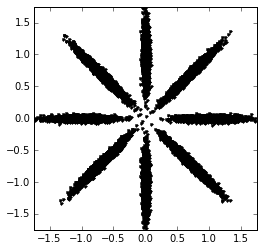
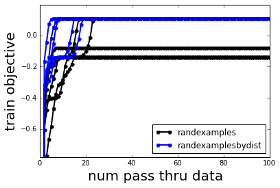

Comparison of initialization methods on Gaussian Toy Data
=========================================================

Goal
----

Solution quality for the standard coordinate ascent algorithms like EM
depend heavily on initialization quality. Here, we'll see how bnpy can
be used to run an experiment comparing two initialization methods, one
smarter than the other.

.. code:: python

    import bnpy
Toy dataset : ``AsteriskK8``
----------------------------

We'll use a simple dataset of 2D points, drawn from 8 well-separated
Gaussian clusters.

.. code:: python

    import AsteriskK8
    Data = AsteriskK8.get_data()
We can visualize this dataset as follows:

.. code:: python

    from matplotlib import pylab
    %pylab inline

.. parsed-literal::

    Populating the interactive namespace from numpy and matplotlib

.. code:: python

    pylab.plot(Data.X[:,0], Data.X[:,1], 'k.');
    pylab.gcf().set_size_inches(4, 4);
    pylab.axis('image'); pylab.xlim([-1.75, 1.75]); pylab.ylim([-1.75, 1.75]);

Initialization Methods
----------------------

Our intended task is to train a Gaussian mixture model using expectation
maximization (EM) with a maximum likelihood criterion.

We'll consider two methods here to initialize the global parameters
(means and covariances) of the Gaussian mixture model.

For more background on possible initializations, see the `Initialization
documentation TODO <../Code/Initialization.md>`__.

Method A: "select examples uniformly at random"
~~~~~~~~~~~~~~~~~~~~~~~~~~~~~~~~~~~~~~~~~~~~~~~

To initialize K clusters, we select K items uniformly at random from all
N data items, and initialize the model as if each item was the only
member of its corresponding component.

This procedure is called ``randexamples`` in **bnpy**. Note: this is the
default initialization.

Method B: "select examples randomly, but biased by Euclidean distance"
~~~~~~~~~~~~~~~~~~~~~~~~~~~~~~~~~~~~~~~~~~~~~~~~~~~~~~~~~~~~~~~~~~~~~~

One problem with the above method is that it doesn't account for
distances between selected points. When using Gaussian observation
models, it can be beneficial for initialized clusters to be spread out
so all data points are more likely to be represented.

Concretely, we could modify the above procedure to choose K items in a
distance-biased way, instead of uniformly at random. We pick the first
item at random from the data, and then for each successive component
select an item n with probability proportional to its distance from the
nearest chosen item among the :math:`k` previously chosen items.

This procedure is called ``randexamplesbydist`` in **bnpy**.

Running the experiment with **bnpy**
------------------------------------

We'll do 25 separate runs for each of the two initialization methods.
Each run gets at most 50 laps through the data, and uses 10 clusters.

The **initname** argument specifies which initialization method to use,
while the **jobname** is a human-readable name for the experiment.

NAIVE INITIALIZATION METHOD: randexamples
~~~~~~~~~~~~~~~~~~~~~~~~~~~~~~~~~~~~~~~~~

.. code:: python

    bnpy.run('AsteriskK8', 'FiniteMixtureModel', 'Gauss', 'EM', 
              nLap=100, K=10, nTask=25, printEvery=100,
              initname='randexamples', jobname='compareinit-K=10-randexamples');

.. parsed-literal::

    Asterisk Toy Data. 8 true clusters.
      size: 25000 units (single observations)
      dimension: 2
    Allocation Model:  Finite mixture with K=10. Dir prior param 1.00
    Obs. Data  Model:  Gaussian with full covariance.
    Obs. Data  Prior:  Gauss-Wishart on each mean/prec matrix pair: mu, Lam
      E[ mu[k] ]     = [ 0.  0.]
      E[ CovMat[k] ] = 
      [[ 1.  0.]
       [ 0.  1.]]
    Learn Alg: EM
    Trial  1/25 | alg. seed: 7451264 | data order seed: 8541952
    savepath: /results/AsteriskK8/compareinit-K=10-randexamples/1
            1/100 after      0 sec. | K   10 | ev -5.038089258e+06 |  
            2/100 after      0 sec. | K   10 | ev -6.053169318e-01 | Ndiff    509.257 
          100/100 after      6 sec. | K   10 | ev -1.380456616e-01 | Ndiff      0.884 
    ... done. not converged. max laps thru data exceeded.
    Trial  2/25 | alg. seed: 5565568 | data order seed: 7673856
    savepath: /results/AsteriskK8/compareinit-K=10-randexamples/2
            1/100 after      0 sec. | K   10 | ev -1.189772070e+07 |  
            2/100 after      0 sec. | K   10 | ev -8.347043150e-01 | Ndiff    216.938 
           37/100 after      2 sec. | K   10 | ev  1.085365655e-01 | Ndiff      0.040 
    ... done. converged.
    Trial  3/25 | alg. seed: 2559616 | data order seed: 7360256
    savepath: /results/AsteriskK8/compareinit-K=10-randexamples/3
            1/100 after      0 sec. | K   10 | ev -3.721051647e+06 |  
            2/100 after      0 sec. | K   10 | ev -5.120293074e-01 | Ndiff    157.057 
          100/100 after      6 sec. | K   10 | ev -7.953044818e-02 | Ndiff      0.806 
    ... done. not converged. max laps thru data exceeded.
    Trial  4/25 | alg. seed: 7606528 | data order seed: 900864
    savepath: /results/AsteriskK8/compareinit-K=10-randexamples/4
            1/100 after      0 sec. | K   10 | ev -6.381918921e+06 |  
            2/100 after      0 sec. | K   10 | ev -4.987179142e-01 | Ndiff    308.318 
          100/100 after      6 sec. | K   10 | ev -1.403154427e-01 | Ndiff      0.118 
    ... done. not converged. max laps thru data exceeded.
    Trial  5/25 | alg. seed: 543872 | data order seed: 6479872
    savepath: /results/AsteriskK8/compareinit-K=10-randexamples/5
            1/100 after      0 sec. | K   10 | ev -4.402459444e+06 |  
            2/100 after      0 sec. | K   10 | ev -4.673188000e-01 | Ndiff    309.553 
           99/100 after      6 sec. | K   10 | ev  1.085656906e-01 | Ndiff      0.049 
    ... done. converged.
    Trial  6/25 | alg. seed: 8294272 | data order seed: 9149952
    savepath: /results/AsteriskK8/compareinit-K=10-randexamples/6
            1/100 after      0 sec. | K   10 | ev -4.532363181e+06 |  
            2/100 after      0 sec. | K   10 | ev -6.146647998e-01 | Ndiff    316.032 
          100/100 after      6 sec. | K   10 | ev  1.087381524e-01 | Ndiff      0.491 
    ... done. not converged. max laps thru data exceeded.
    Trial  7/25 | alg. seed: 6597632 | data order seed: 3441280
    savepath: /results/AsteriskK8/compareinit-K=10-randexamples/7
            1/100 after      0 sec. | K   10 | ev -5.423481616e+06 |  
            2/100 after      0 sec. | K   10 | ev -5.894783288e-01 | Ndiff    623.997 
          100/100 after      7 sec. | K   10 | ev -1.411017196e-01 | Ndiff      0.734 
    ... done. not converged. max laps thru data exceeded.
    Trial  8/25 | alg. seed: 5652864 | data order seed: 899584
    savepath: /results/AsteriskK8/compareinit-K=10-randexamples/8
            1/100 after      0 sec. | K   10 | ev -4.618649171e+06 |  
            2/100 after      0 sec. | K   10 | ev -6.701893507e-01 | Ndiff    320.923 
          100/100 after      7 sec. | K   10 | ev  1.085938360e-01 | Ndiff      0.404 
    ... done. not converged. max laps thru data exceeded.
    Trial  9/25 | alg. seed: 478720 | data order seed: 3785600
    savepath: /results/AsteriskK8/compareinit-K=10-randexamples/9
            1/100 after      0 sec. | K   10 | ev -5.109595937e+06 |  
            2/100 after      0 sec. | K   10 | ev -6.427303551e-01 | Ndiff    319.450 
           20/100 after      1 sec. | K   10 | ev  1.085102777e-01 | Ndiff      0.037 
    ... done. converged.
    Trial 10/25 | alg. seed: 955776 | data order seed: 6801920
    savepath: /results/AsteriskK8/compareinit-K=10-randexamples/10
            1/100 after      0 sec. | K   10 | ev -3.769531359e+06 |  
            2/100 after      0 sec. | K   10 | ev -2.988518456e-01 | Ndiff    488.401 
          100/100 after      6 sec. | K   10 | ev  1.086153722e-01 | Ndiff      0.217 
    ... done. not converged. max laps thru data exceeded.
    Trial 11/25 | alg. seed: 3296640 | data order seed: 2531072
    savepath: /results/AsteriskK8/compareinit-K=10-randexamples/11
            1/100 after      0 sec. | K   10 | ev -4.402603216e+06 |  
            2/100 after      0 sec. | K   10 | ev -7.074510784e-01 | Ndiff    630.905 
          100/100 after      6 sec. | K   10 | ev  1.086250809e-01 | Ndiff      0.421 
    ... done. not converged. max laps thru data exceeded.
    Trial 12/25 | alg. seed: 2183296 | data order seed: 3886080
    savepath: /results/AsteriskK8/compareinit-K=10-randexamples/12
            1/100 after      0 sec. | K   10 | ev -4.568839580e+06 |  
            2/100 after      0 sec. | K   10 | ev -7.081996005e-01 | Ndiff    581.581 
          100/100 after      6 sec. | K   10 | ev  1.085405004e-01 | Ndiff      0.249 
    ... done. not converged. max laps thru data exceeded.
    Trial 13/25 | alg. seed: 9082752 | data order seed: 8818688
    savepath: /results/AsteriskK8/compareinit-K=10-randexamples/13
            1/100 after      0 sec. | K   10 | ev -2.125579148e+07 |  
            2/100 after      0 sec. | K   10 | ev -7.031932089e-01 | Ndiff    291.678 
          100/100 after      6 sec. | K   10 | ev -3.281586650e-01 | Ndiff      0.858 
    ... done. not converged. max laps thru data exceeded.
    Trial 14/25 | alg. seed: 1826176 | data order seed: 3528320
    savepath: /results/AsteriskK8/compareinit-K=10-randexamples/14
            1/100 after      0 sec. | K   10 | ev -5.114279451e+06 |  
            2/100 after      0 sec. | K   10 | ev -5.950452856e-01 | Ndiff    765.461 
          100/100 after      6 sec. | K   10 | ev -1.379526882e-01 | Ndiff      0.188 
    ... done. not converged. max laps thru data exceeded.
    Trial 15/25 | alg. seed: 2865664 | data order seed: 1024640
    savepath: /results/AsteriskK8/compareinit-K=10-randexamples/15
            1/100 after      0 sec. | K   10 | ev -3.663796388e+06 |  
            2/100 after      0 sec. | K   10 | ev -5.210069660e-01 | Ndiff    231.593 
          100/100 after      6 sec. | K   10 | ev  1.086179282e-01 | Ndiff      0.207 
    ... done. not converged. max laps thru data exceeded.
    Trial 16/25 | alg. seed: 6036480 | data order seed: 8819712
    savepath: /results/AsteriskK8/compareinit-K=10-randexamples/16
            1/100 after      0 sec. | K   10 | ev -2.933777901e+06 |  
            2/100 after      0 sec. | K   10 | ev -3.786765581e-01 | Ndiff    545.778 
          100/100 after      6 sec. | K   10 | ev -1.399924635e-01 | Ndiff      0.254 
    ... done. not converged. max laps thru data exceeded.
    Trial 17/25 | alg. seed: 8729088 | data order seed: 9034368
    savepath: /results/AsteriskK8/compareinit-K=10-randexamples/17
            1/100 after      0 sec. | K   10 | ev -6.810981797e+06 |  
            2/100 after      0 sec. | K   10 | ev -6.580048086e-01 | Ndiff    320.708 
          100/100 after      6 sec. | K   10 | ev -1.378493652e-01 | Ndiff      0.376 
    ... done. not converged. max laps thru data exceeded.
    Trial 18/25 | alg. seed: 8933248 | data order seed: 9882240
    savepath: /results/AsteriskK8/compareinit-K=10-randexamples/18
            1/100 after      0 sec. | K   10 | ev -6.079875910e+06 |  
            2/100 after      0 sec. | K   10 | ev -5.028302631e-01 | Ndiff    403.851 
           43/100 after      3 sec. | K   10 | ev  1.085357929e-01 | Ndiff      0.048 
    ... done. converged.
    Trial 19/25 | alg. seed: 793600 | data order seed: 3803392
    savepath: /results/AsteriskK8/compareinit-K=10-randexamples/19
            1/100 after      0 sec. | K   10 | ev -5.004002662e+06 |  
            2/100 after      0 sec. | K   10 | ev -5.655078001e-01 | Ndiff    220.619 
          100/100 after      6 sec. | K   10 | ev  1.086034468e-01 | Ndiff      0.886 
    ... done. not converged. max laps thru data exceeded.
    Trial 20/25 | alg. seed: 6725120 | data order seed: 1715072
    savepath: /results/AsteriskK8/compareinit-K=10-randexamples/20
            1/100 after      0 sec. | K   10 | ev -7.214520759e+06 |  
            2/100 after      0 sec. | K   10 | ev -6.808426692e-01 | Ndiff    691.060 
          100/100 after      6 sec. | K   10 | ev -1.373090811e-01 | Ndiff      0.355 
    ... done. not converged. max laps thru data exceeded.
    Trial 21/25 | alg. seed: 4116864 | data order seed: 6033536
    savepath: /results/AsteriskK8/compareinit-K=10-randexamples/21
            1/100 after      0 sec. | K   10 | ev -2.772559421e+06 |  
            2/100 after      0 sec. | K   10 | ev -3.332692393e-01 | Ndiff    232.407 
           25/100 after      2 sec. | K   10 | ev  1.085881812e-01 | Ndiff      0.042 
    ... done. converged.
    Trial 22/25 | alg. seed: 4644096 | data order seed: 8644096
    savepath: /results/AsteriskK8/compareinit-K=10-randexamples/22
            1/100 after      0 sec. | K   10 | ev -6.591496824e+06 |  
            2/100 after      0 sec. | K   10 | ev -8.144558164e-01 | Ndiff    414.050 
           40/100 after      3 sec. | K   10 | ev -1.377360370e-01 | Ndiff      0.050 
    ... done. converged.
    Trial 23/25 | alg. seed: 9808000 | data order seed: 2513920
    savepath: /results/AsteriskK8/compareinit-K=10-randexamples/23
            1/100 after      0 sec. | K   10 | ev -5.606828878e+06 |  
            2/100 after      0 sec. | K   10 | ev -6.281483384e-01 | Ndiff    120.879 
          100/100 after      6 sec. | K   10 | ev  1.086061951e-01 | Ndiff      0.324 
    ... done. not converged. max laps thru data exceeded.
    Trial 24/25 | alg. seed: 447360 | data order seed: 6039296
    savepath: /results/AsteriskK8/compareinit-K=10-randexamples/24
            1/100 after      0 sec. | K   10 | ev -4.547278148e+06 |  
            2/100 after      0 sec. | K   10 | ev -6.680528521e-01 | Ndiff    637.874 
          100/100 after      6 sec. | K   10 | ev  1.087554959e-01 | Ndiff      0.218 
    ... done. not converged. max laps thru data exceeded.
    Trial 25/25 | alg. seed: 818944 | data order seed: 7907200
    savepath: /results/AsteriskK8/compareinit-K=10-randexamples/25
            1/100 after      0 sec. | K   10 | ev -6.515168176e+06 |  
            2/100 after      0 sec. | K   10 | ev -7.869080181e-01 | Ndiff    394.908 
          100/100 after      6 sec. | K   10 | ev  1.086201284e-01 | Ndiff      0.574 
    ... done. not converged. max laps thru data exceeded.

SMART INITIALIZATION METHOD: randexamplesbydist
~~~~~~~~~~~~~~~~~~~~~~~~~~~~~~~~~~~~~~~~~~~~~~~

.. code:: python

    bnpy.run('AsteriskK8', 'FiniteMixtureModel', 'Gauss', 'EM',
              nLap=100, K=10, nTask=25, printEvery=100,
              initname='randexamplesbydist', jobname='compareinit-K=10-randexamplesbydist');

.. parsed-literal::

    Asterisk Toy Data. 8 true clusters.
      size: 25000 units (single observations)
      dimension: 2
    Allocation Model:  Finite mixture with K=10. Dir prior param 1.00
    Obs. Data  Model:  Gaussian with full covariance.
    Obs. Data  Prior:  Gauss-Wishart on each mean/prec matrix pair: mu, Lam
      E[ mu[k] ]     = [ 0.  0.]
      E[ CovMat[k] ] = 
      [[ 1.  0.]
       [ 0.  1.]]
    Learn Alg: EM
    Trial  1/25 | alg. seed: 7451264 | data order seed: 8541952
    savepath: /results/AsteriskK8/compareinit-K=10-randexamplesbydist/1
            1/100 after      0 sec. | K   10 | ev -2.973288219e+06 |  
            2/100 after      0 sec. | K   10 | ev -3.486995300e-01 | Ndiff    829.097 
          100/100 after      6 sec. | K   10 | ev  1.085691707e-01 | Ndiff      0.395 
    ... done. not converged. max laps thru data exceeded.
    Trial  2/25 | alg. seed: 5565568 | data order seed: 7673856
    savepath: /results/AsteriskK8/compareinit-K=10-randexamplesbydist/2
            1/100 after      0 sec. | K   10 | ev -3.516407474e+06 |  
            2/100 after      0 sec. | K   10 | ev -3.420936820e-01 | Ndiff    931.372 
          100/100 after      6 sec. | K   10 | ev  1.085788381e-01 | Ndiff      0.291 
    ... done. not converged. max laps thru data exceeded.
    Trial  3/25 | alg. seed: 2559616 | data order seed: 7360256
    savepath: /results/AsteriskK8/compareinit-K=10-randexamplesbydist/3
            1/100 after      0 sec. | K   10 | ev -2.657419116e+06 |  
            2/100 after      0 sec. | K   10 | ev -3.169381737e-01 | Ndiff    327.129 
           38/100 after      2 sec. | K   10 | ev  1.085878268e-01 | Ndiff      0.042 
    ... done. converged.
    Trial  4/25 | alg. seed: 7606528 | data order seed: 900864
    savepath: /results/AsteriskK8/compareinit-K=10-randexamplesbydist/4
            1/100 after      0 sec. | K   10 | ev -2.751791130e+06 |  
            2/100 after      0 sec. | K   10 | ev -1.664797694e-01 | Ndiff    916.668 
          100/100 after      6 sec. | K   10 | ev  1.086099225e-01 | Ndiff      0.205 
    ... done. not converged. max laps thru data exceeded.
    Trial  5/25 | alg. seed: 543872 | data order seed: 6479872
    savepath: /results/AsteriskK8/compareinit-K=10-randexamplesbydist/5
            1/100 after      0 sec. | K   10 | ev -2.722948944e+06 |  
            2/100 after      0 sec. | K   10 | ev -3.466986621e-01 | Ndiff    380.578 
          100/100 after      6 sec. | K   10 | ev  1.085382985e-01 | Ndiff      0.254 
    ... done. not converged. max laps thru data exceeded.
    Trial  6/25 | alg. seed: 8294272 | data order seed: 9149952
    savepath: /results/AsteriskK8/compareinit-K=10-randexamplesbydist/6
            1/100 after      0 sec. | K   10 | ev -2.406340227e+06 |  
            2/100 after      0 sec. | K   10 | ev -5.604639580e-02 | Ndiff    924.765 
          100/100 after      6 sec. | K   10 | ev  1.086271058e-01 | Ndiff      0.463 
    ... done. not converged. max laps thru data exceeded.
    Trial  7/25 | alg. seed: 6597632 | data order seed: 3441280
    savepath: /results/AsteriskK8/compareinit-K=10-randexamplesbydist/7
            1/100 after      0 sec. | K   10 | ev -3.515840550e+06 |  
            2/100 after      0 sec. | K   10 | ev -2.408568424e-01 | Ndiff    214.998 
          100/100 after      6 sec. | K   10 | ev  1.086368202e-01 | Ndiff      0.287 
    ... done. not converged. max laps thru data exceeded.
    Trial  8/25 | alg. seed: 5652864 | data order seed: 899584
    savepath: /results/AsteriskK8/compareinit-K=10-randexamplesbydist/8
            1/100 after      0 sec. | K   10 | ev -1.469471223e+06 |  
            2/100 after      0 sec. | K   10 | ev  2.754242891e-02 | Ndiff    515.001 
          100/100 after      6 sec. | K   10 | ev  1.086463222e-01 | Ndiff      0.427 
    ... done. not converged. max laps thru data exceeded.
    Trial  9/25 | alg. seed: 478720 | data order seed: 3785600
    savepath: /results/AsteriskK8/compareinit-K=10-randexamplesbydist/9
            1/100 after      0 sec. | K   10 | ev -3.733528245e+06 |  
            2/100 after      0 sec. | K   10 | ev -2.436933674e-01 | Ndiff    486.192 
          100/100 after      6 sec. | K   10 | ev -1.378186454e-01 | Ndiff      0.724 
    ... done. not converged. max laps thru data exceeded.
    Trial 10/25 | alg. seed: 955776 | data order seed: 6801920
    savepath: /results/AsteriskK8/compareinit-K=10-randexamplesbydist/10
            1/100 after      0 sec. | K   10 | ev -2.484298416e+06 |  
            2/100 after      0 sec. | K   10 | ev -4.207457791e-02 | Ndiff    533.266 
          100/100 after      7 sec. | K   10 | ev  1.086217547e-01 | Ndiff      0.343 
    ... done. not converged. max laps thru data exceeded.
    Trial 11/25 | alg. seed: 3296640 | data order seed: 2531072
    savepath: /results/AsteriskK8/compareinit-K=10-randexamplesbydist/11
            1/100 after      0 sec. | K   10 | ev -1.795773630e+06 |  
            2/100 after      0 sec. | K   10 | ev  2.527338885e-02 | Ndiff    482.198 
          100/100 after      8 sec. | K   10 | ev  1.086989328e-01 | Ndiff      0.199 
    ... done. not converged. max laps thru data exceeded.
    Trial 12/25 | alg. seed: 2183296 | data order seed: 3886080
    savepath: /results/AsteriskK8/compareinit-K=10-randexamplesbydist/12
            1/100 after      0 sec. | K   10 | ev -1.992792616e+06 |  
            2/100 after      0 sec. | K   10 | ev  5.480104246e-03 | Ndiff   1024.936 
          100/100 after      7 sec. | K   10 | ev  1.086133239e-01 | Ndiff      0.320 
    ... done. not converged. max laps thru data exceeded.
    Trial 13/25 | alg. seed: 9082752 | data order seed: 8818688
    savepath: /results/AsteriskK8/compareinit-K=10-randexamplesbydist/13
            1/100 after      0 sec. | K   10 | ev -1.704159885e+06 |  
            2/100 after      0 sec. | K   10 | ev  1.195677204e-02 | Ndiff    505.249 
          100/100 after      6 sec. | K   10 | ev  1.085490705e-01 | Ndiff      0.174 
    ... done. not converged. max laps thru data exceeded.
    Trial 14/25 | alg. seed: 1826176 | data order seed: 3528320
    savepath: /results/AsteriskK8/compareinit-K=10-randexamplesbydist/14
            1/100 after      0 sec. | K   10 | ev -2.732785243e+06 |  
            2/100 after      0 sec. | K   10 | ev -8.596664095e-02 | Ndiff    628.192 
           42/100 after      3 sec. | K   10 | ev  1.087651192e-01 | Ndiff      0.038 
    ... done. converged.
    Trial 15/25 | alg. seed: 2865664 | data order seed: 1024640
    savepath: /results/AsteriskK8/compareinit-K=10-randexamplesbydist/15
            1/100 after      0 sec. | K   10 | ev -2.748786748e+06 |  
            2/100 after      0 sec. | K   10 | ev -1.765417825e-01 | Ndiff    437.656 
          100/100 after      6 sec. | K   10 | ev  1.086107604e-01 | Ndiff      0.885 
    ... done. not converged. max laps thru data exceeded.
    Trial 16/25 | alg. seed: 6036480 | data order seed: 8819712
    savepath: /results/AsteriskK8/compareinit-K=10-randexamplesbydist/16
            1/100 after      0 sec. | K   10 | ev -1.900608507e+06 |  
            2/100 after      0 sec. | K   10 | ev  3.803285222e-02 | Ndiff    484.298 
          100/100 after      6 sec. | K   10 | ev  1.085349435e-01 | Ndiff      0.183 
    ... done. not converged. max laps thru data exceeded.
    Trial 17/25 | alg. seed: 8729088 | data order seed: 9034368
    savepath: /results/AsteriskK8/compareinit-K=10-randexamplesbydist/17
            1/100 after      0 sec. | K   10 | ev -1.754183848e+06 |  
            2/100 after      0 sec. | K   10 | ev  7.174857095e-02 | Ndiff    336.239 
          100/100 after      6 sec. | K   10 | ev  1.086679765e-01 | Ndiff      0.944 
    ... done. not converged. max laps thru data exceeded.
    Trial 18/25 | alg. seed: 8933248 | data order seed: 9882240
    savepath: /results/AsteriskK8/compareinit-K=10-randexamplesbydist/18
            1/100 after      0 sec. | K   10 | ev -1.814913282e+06 |  
            2/100 after      0 sec. | K   10 | ev  6.653621097e-02 | Ndiff    946.316 
          100/100 after      6 sec. | K   10 | ev  1.088050340e-01 | Ndiff      0.496 
    ... done. not converged. max laps thru data exceeded.
    Trial 19/25 | alg. seed: 793600 | data order seed: 3803392
    savepath: /results/AsteriskK8/compareinit-K=10-randexamplesbydist/19
            1/100 after      0 sec. | K   10 | ev -3.242194590e+06 |  
            2/100 after      0 sec. | K   10 | ev -4.947691338e-01 | Ndiff    527.991 
          100/100 after      6 sec. | K   10 | ev -1.407649636e-01 | Ndiff      0.285 
    ... done. not converged. max laps thru data exceeded.
    Trial 20/25 | alg. seed: 6725120 | data order seed: 1715072
    savepath: /results/AsteriskK8/compareinit-K=10-randexamplesbydist/20
            1/100 after      0 sec. | K   10 | ev -3.185016013e+06 |  
            2/100 after      0 sec. | K   10 | ev -3.487384455e-01 | Ndiff    640.851 
           29/100 after      2 sec. | K   10 | ev  1.085578749e-01 | Ndiff      0.027 
    ... done. converged.
    Trial 21/25 | alg. seed: 4116864 | data order seed: 6033536
    savepath: /results/AsteriskK8/compareinit-K=10-randexamplesbydist/21
            1/100 after      0 sec. | K   10 | ev -1.870167507e+06 |  
            2/100 after      0 sec. | K   10 | ev -4.590489542e-02 | Ndiff    651.301 
          100/100 after      6 sec. | K   10 | ev  1.085518159e-01 | Ndiff      0.242 
    ... done. not converged. max laps thru data exceeded.
    Trial 22/25 | alg. seed: 4644096 | data order seed: 8644096
    savepath: /results/AsteriskK8/compareinit-K=10-randexamplesbydist/22
            1/100 after      0 sec. | K   10 | ev -2.321864828e+06 |  
            2/100 after      0 sec. | K   10 | ev -3.460784895e-01 | Ndiff    528.638 
          100/100 after      6 sec. | K   10 | ev  1.085986711e-01 | Ndiff      0.217 
    ... done. not converged. max laps thru data exceeded.
    Trial 23/25 | alg. seed: 9808000 | data order seed: 2513920
    savepath: /results/AsteriskK8/compareinit-K=10-randexamplesbydist/23
            1/100 after      0 sec. | K   10 | ev -2.047671369e+06 |  
            2/100 after      0 sec. | K   10 | ev -4.337725639e-02 | Ndiff    525.865 
           48/100 after      3 sec. | K   10 | ev  1.085136308e-01 | Ndiff      0.048 
    ... done. converged.
    Trial 24/25 | alg. seed: 447360 | data order seed: 6039296
    savepath: /results/AsteriskK8/compareinit-K=10-randexamplesbydist/24
            1/100 after      0 sec. | K   10 | ev -1.907191394e+06 |  
            2/100 after      0 sec. | K   10 | ev  2.232573780e-03 | Ndiff    749.043 
          100/100 after      6 sec. | K   10 | ev  1.086538157e-01 | Ndiff      0.399 
    ... done. not converged. max laps thru data exceeded.
    Trial 25/25 | alg. seed: 818944 | data order seed: 7907200
    savepath: /results/AsteriskK8/compareinit-K=10-randexamplesbydist/25
            1/100 after      0 sec. | K   10 | ev -3.083391707e+06 |  
            2/100 after      0 sec. | K   10 | ev -2.801351837e-01 | Ndiff    691.918 
          100/100 after      6 sec. | K   10 | ev  1.087014840e-01 | Ndiff      0.294 
    ... done. not converged. max laps thru data exceeded.

Analyzing results
-----------------

Using **bnpy**'s built-in visualization tools, we can easily make a plot
comparing the two methods.

.. code:: python

    bnpy.viz.PlotELBO.plotJobsThatMatchKeywords('AsteriskK8/compareinit-K=10-*')
    pylab.legend(loc='lower right');
    pylab.xlabel('num pass thru data', fontsize=20);
    pylab.ylabel('train objective', fontsize=20);

This plot shows that across many runs, the ``randexamplesbydist``
procedure consistently reaches better objective function values than the
simpler, more naive baseline.
